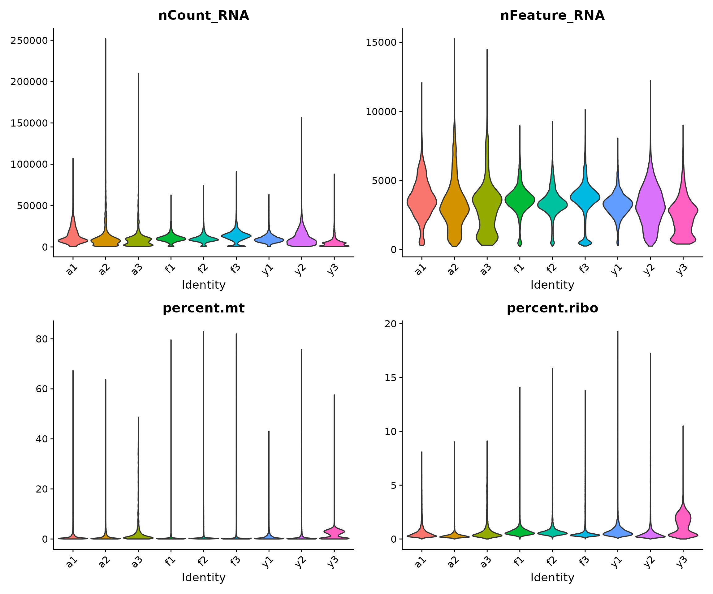
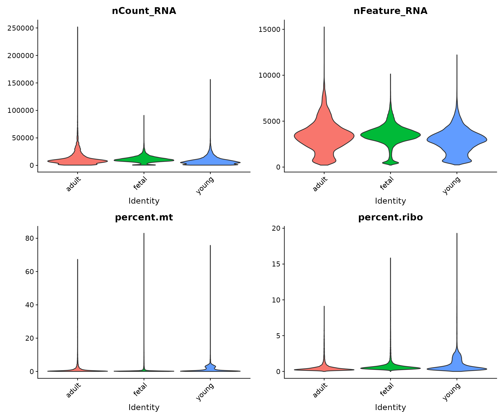
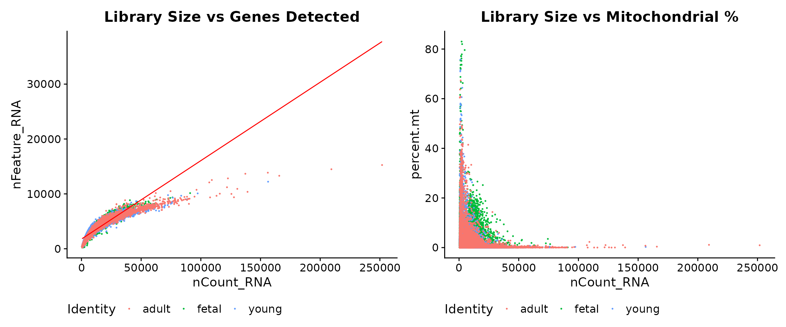
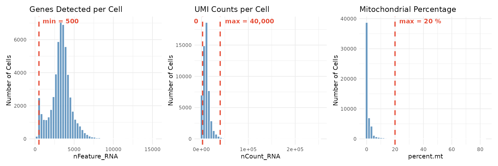
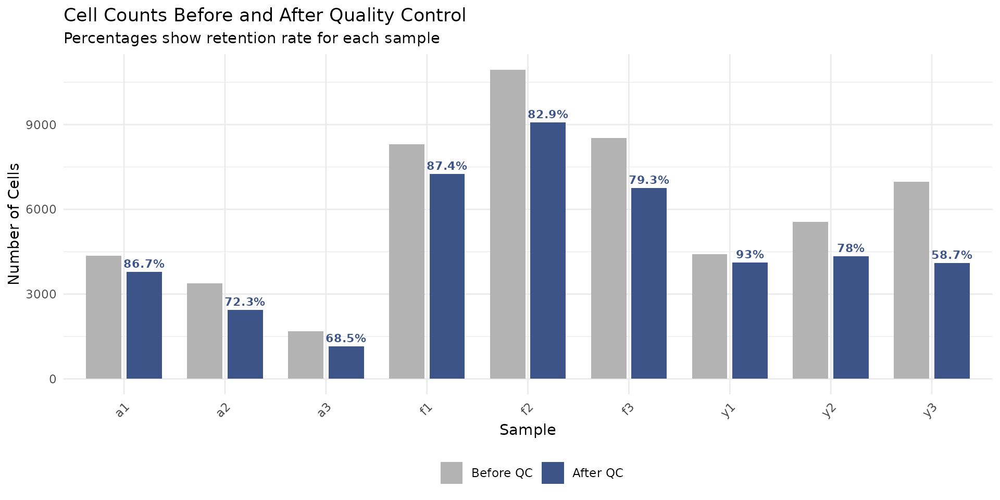
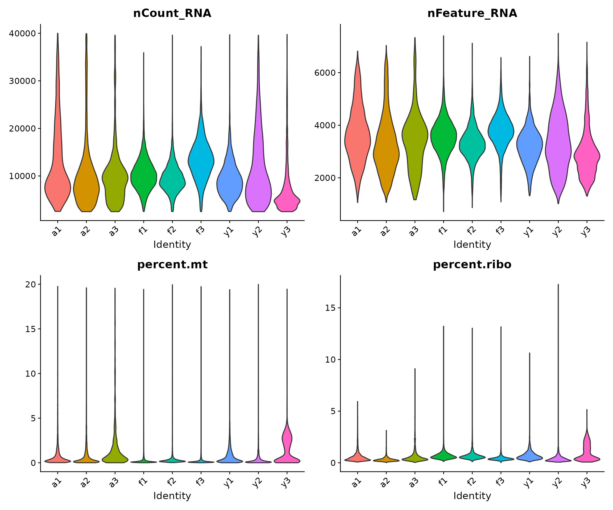
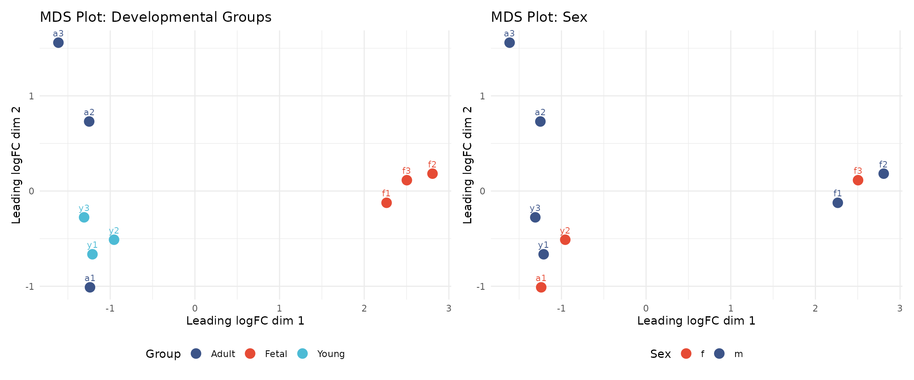

# Module 1: Quality Control

## Introduction

Quality control (QC) is a critical first step in any single cell
RNA-sequencing (scRNA-seq) analysis. The goal of QC is to identify and
remove low-quality cells that could confound downstream analysis. Poor
quality cells can arise from several sources: empty droplets that
contain only ambient RNA, or dying cells that have compromised
membranes.

In this module, we work with single nuclei RNA-sequencing (snRNA-seq)
data from human heart tissue. The data comes from a study examining
human heart development across three stages: foetal, young, and adult
(Sim et al., 2021, *Circulation*). Understanding how the heart changes
at the cellular level across development provides insights into cardiac
maturation and potential therapeutic targets.

### What is Single Cell RNA-Sequencing?

Traditional “bulk” RNA-sequencing measures the average gene expression
across millions of cells. While powerful, this approach masks the
heterogeneity that exists within tissues. Single cell RNA-sequencing
overcomes this limitation by measuring gene expression in individual
cells, allowing us to:

- Identify distinct cell types within a tissue
- Discover rare cell populations
- Study cell-to-cell variability
- Track cellular states during development or disease

The most widely used platform for scRNA-seq is the 10X Genomics Chromium
system, which captures cells in oil droplets along with barcoded beads.
Each bead carries oligonucleotides with three key components:

1.  **Cell barcode**: Identifies which cell the RNA came from
2.  **Unique Molecular Identifier (UMI)**: Identifies individual RNA
    molecules, removing PCR amplification bias
3.  **Poly-dT tail**: Captures polyadenylated mRNA

### Learning Objectives

By the end of this module, you will be able to:

1.  Load and explore scRNA-seq count data in R
2.  Understand the structure of a Seurat object
3.  Calculate and interpret per-cell quality control metrics
4.  Apply filtering thresholds to remove low-quality cells
5.  Visualise sample-level relationships using pseudobulk aggregation

### Setup: Loading Required Libraries

The first step is to load the R packages we will use throughout this
module. Each package provides specific functionality:

- **Seurat**: The primary framework for single cell analysis, providing
  functions for data manipulation, normalisation, clustering, and
  visualisation
- **ggplot2**: Creating publication-quality plots using the grammar of
  graphics
- **patchwork**: Combining multiple plots into composite figures
- **dplyr**: Data manipulation using intuitive verbs (filter, select,
  mutate, etc.)
- **edgeR**: Tools for RNA-seq analysis, used here for pseudobulk
  visualisation
- **org.Hs.eg.db**: Database of human gene annotations

``` r

library(Seurat)
library(ggplot2)
library(patchwork)
library(dplyr)
library(edgeR)
library(org.Hs.eg.db)
library(AnnotationDbi)
```

### Colour Palette

We define a consistent colour scheme for all visualisations. The
developmental groups follow a biological progression from warm (foetal)
to cool (adult) tones:

``` r

# Developmental group colours
group_colors <- c(
    "Fetal" = "#E64B35",
    "Young" = "#4DBBD5",
    "Adult" = "#3C5488"
)

# Sample colours - shades within each group
sample_colors <- c(
    "f1" = "#E64B35", "f2" = "#F39B7F", "f3" = "#FFCAB0",
    "y1" = "#4DBBD5", "y2" = "#91D1C2", "y3" = "#C5E8E0",
    "a1" = "#3C5488", "a2" = "#8491B4", "a3" = "#B4BCD4"
)
```

## Loading the Data

### Understanding the Data Files

Our workshop data consists of two files:

1.  **heart-counts.Rds**: A sparse matrix containing UMI counts for each
    gene in each cell. The rows represent genes (~34,000) and the
    columns represent cells (~54,000). The matrix is stored in a
    “sparse” format because most entries are zero (a gene is typically
    detected in only a subset of cells), and sparse matrices use much
    less memory than regular matrices.

2.  **cellinfo_updated.Rds**: A data frame containing metadata for each
    cell, including which sample it came from, the developmental group
    (foetal, young, or adult), and the sex of the donor.

Let us load these files and examine their structure:

``` r

# Set the path to the data directory
# We use a relative path from the tutorials folder
data_dir <- "../data"

# Load the count matrix
# readRDS() reads an R object that was saved with saveRDS()
counts <- readRDS(file.path(data_dir, "heart-counts.Rds"))

# Load the cell metadata
cellinfo <- readRDS(file.path(data_dir, "cellinfo_updated.Rds"))
```

### Exploring the Count Matrix

The count matrix is the core data structure in scRNA-seq analysis. Each
entry represents the number of UMI counts for a particular gene in a
particular cell. Let us examine its dimensions and structure:

``` r

# Check dimensions and structure of the count matrix
cat("Count matrix:\n")
```

    ## Count matrix:

``` r

cat("- Class:", class(counts), "\n")
```

    ## - Class: dgCMatrix

``` r

cat("- Genes:", format(nrow(counts), big.mark = ","), "\n")
```

    ## - Genes: 33,939

``` r

cat("- Cells:", format(ncol(counts), big.mark = ","), "\n")
```

    ## - Cells: 54,140

The cell barcodes follow the format `BARCODE_SAMPLE`, where the suffix
(e.g., `_f1`) indicates which sample the cell came from. This naming
convention helps us track cells back to their sample of origin.

### Exploring the Cell Metadata

The cell metadata contains information about each cell that we will use
throughout our analysis:

``` r

# Check the structure of the metadata
dim(cellinfo)
```

    ## [1] 54140     7

``` r

head(cellinfo)
```

    ##                CellID Sample Sex          Celltype Group     Orig_Celltype
    ## 1 AAACCCAAGGACAACC_f1     f1   m        Fibroblast fetal       Fibroblast1
    ## 2 AAACCCAAGGTCCGAA_f1     f1   m  Epicardial cells fetal          Pericyte
    ## 3 AAACCCAAGTTTCGAC_f1     f1   m Endothelial cells fetal Endothelial cells
    ## 4 AAACCCACAAATGAGT_f1     f1   m  Epicardial cells fetal          Pericyte
    ## 5 AAACCCATCATTGCGA_f1     f1   m    Cardiomyocytes fetal   Cardiomyocytes1
    ## 6 AAACCCATCGTTCCTG_f1     f1   m      Immune cells fetal        Mast cells
    ##   RefinedCellType
    ## 1         fibro-0
    ## 2          epic-1
    ## 3          endo-4
    ## 4          epic-1
    ## 5        cardio-0
    ## 6        immune-5

The metadata contains several columns:

- **CellID**: Unique identifier for each cell (matches column names in
  the count matrix)
- **Sample**: Sample identifier (f1-f3 for foetal, y1-y3 for young,
  a1-a3 for adult)
- **Sex**: Donor sex (m = male, f = female)
- **Group**: Developmental stage (foetal, young, or adult)

Let us examine the sample composition of our dataset:

``` r

# Cells per sample and group
table(cellinfo$Sample, cellinfo$Group)
```

    ##     
    ##      adult fetal young
    ##   a1  4360     0     0
    ##   a2  3375     0     0
    ##   a3  1681     0     0
    ##   f1     0  8296     0
    ##   f2     0 10948     0
    ##   f3     0  8516     0
    ##   y1     0     0  4422
    ##   y2     0     0  5558
    ##   y3     0     0  6984

We have 9 samples: 3 foetal (f1, f2, f3), 3 young (y1, y2, y3), and 3
adult (a1, a2, a3). Having biological replicates (multiple samples per
group) is essential for statistical analysis, as it allows us to
distinguish biological variation from technical noise.

### Creating a Seurat Object

*Seurat* is the most widely used R package for single cell analysis. The
Seurat object is a container that holds the count matrix, cell metadata,
and all results from downstream analyses (normalisation, clustering,
etc.) in a single object. This makes it easy to keep track of all data
and results.

Here, we create a Seurat object from our count matrix:

``` r

# Create the Seurat object
# min.cells = 3: Keep genes detected in at least 3 cells (removes very rare genes)
# min.features = 200: Keep cells with at least 200 genes detected (removes likely empty droplets)
seu <- CreateSeuratObject(
    counts = counts,
    project = "heart_workshop",
    min.cells = 3,
    min.features = 200
)

# Report what was filtered
cat("Initial filtering:\n")
```

    ## Initial filtering:

``` r

cat("- Genes:", nrow(counts), "->", nrow(seu), "\n")
```

    ## - Genes: 33939 -> 29323

``` r

cat("- Cells:", ncol(counts), "->", ncol(seu), "\n")
```

    ## - Cells: 54140 -> 54135

The `min.cells` and `min.features` parameters perform initial filtering:

- `min.cells = 3`: Removes genes detected in fewer than 3 cells. These
  very rare genes add noise without contributing meaningful biological
  information.
- `min.features = 200`: Removes cells with fewer than 200 genes
  detected. Cells with very few genes are likely empty droplets
  containing only ambient RNA.

### Adding Sample Metadata

Next, we add the sample metadata to our Seurat object. This information
will be used for grouping cells in visualisations and statistical
analyses.

``` r

# The cell order in the Seurat object may differ from the metadata
# We need to match them by cell ID
cellinfo_matched <- cellinfo[match(colnames(seu), cellinfo$CellID), ]

# Verify the matching worked correctly
stopifnot(all(colnames(seu) == cellinfo_matched$CellID))

# Add metadata columns to the Seurat object
seu$sample <- cellinfo_matched$Sample
seu$group <- cellinfo_matched$Group
seu$sex <- cellinfo_matched$Sex

# Clean up large objects to free memory
rm(counts, cellinfo, cellinfo_matched)
gc()  # Garbage collection to release memory
```

    ##             used   (Mb) gc trigger   (Mb)   max used   (Mb)
    ## Ncells   7682881  410.4   13959487  745.6   12640770  675.1
    ## Vcells 281892874 2150.7 1210321682 9234.1 1180023552 9002.9

### Examining the Seurat Object

Let us examine the structure of our Seurat object:

``` r

# Print a summary of the object
seu
```

    ## An object of class Seurat 
    ## 29323 features across 54135 samples within 1 assay 
    ## Active assay: RNA (29323 features, 0 variable features)
    ##  1 layer present: counts

``` r

# View the first few rows of metadata
head(seu@meta.data)
```

    ##                         orig.ident nCount_RNA nFeature_RNA sample group sex
    ## AAACCCAAGGACAACC_f1 heart_workshop       9503         3588     f1 fetal   m
    ## AAACCCAAGGTCCGAA_f1 heart_workshop      19729         5861     f1 fetal   m
    ## AAACCCAAGTTTCGAC_f1 heart_workshop       7748         2973     f1 fetal   m
    ## AAACCCACAAATGAGT_f1 heart_workshop       8640         3167     f1 fetal   m
    ## AAACCCATCATTGCGA_f1 heart_workshop      11820         4017     f1 fetal   m
    ## AAACCCATCGTTCCTG_f1 heart_workshop       5826         2134     f1 fetal   m

The Seurat object automatically creates two metadata columns:

- **nCount_RNA**: Total UMI counts per cell (also called “library size”)
- **nFeature_RNA**: Number of genes detected per cell (also called “gene
  count”)

We added three more columns: `sample`, `group`, and `sex`.

## Gene Annotation

### Why Annotate Genes?

Before calculating quality control metrics, we need to identify specific
classes of genes. In particular, we are interested in:

1.  **Mitochondrial genes**: High mitochondrial gene expression often
    indicates cell stress or death. When a cell’s membrane is
    compromised, cytoplasmic RNA leaks out while mitochondrial RNA
    (protected within the mitochondria) is retained, leading to an
    elevated mitochondrial fraction.

2.  **Ribosomal genes**: These are highly expressed in most cells but
    are generally not informative for distinguishing cell types. While
    not typically used for filtering, tracking ribosomal content can
    provide insights into cellular activity.

We use the *org.Hs.eg.db* package, which contains comprehensive
annotation information for human genes.

``` r

# Get the list of gene names from our Seurat object
gene_symbols <- rownames(seu)

# Query the annotation database
# We request the gene symbol, Entrez ID, full name, and chromosome
ann <- AnnotationDbi::select(
    org.Hs.eg.db,
    keys = gene_symbols,
    columns = c("SYMBOL", "ENTREZID", "GENENAME", "CHR"),
    keytype = "SYMBOL"
)

# Some genes may have multiple entries; keep only the first match
ann <- ann[!duplicated(ann$SYMBOL), ]

# Match annotations to the gene order in our Seurat object
ann <- ann[match(gene_symbols, ann$SYMBOL), ]

# Report annotation success rate
cat("Gene annotation:\n")
```

    ## Gene annotation:

``` r

cat("- Total genes:", length(gene_symbols), "\n")
```

    ## - Total genes: 29323

``` r

cat("- Annotated:", sum(!is.na(ann$GENENAME)), "\n")
```

    ## - Annotated: 20071

``` r

cat("- Success rate:", round(sum(!is.na(ann$GENENAME)) / length(gene_symbols) * 100, 1), "%\n")
```

    ## - Success rate: 68.4 %

### Identifying Mitochondrial Genes

Mitochondrial genes in human data can be identified by their gene names,
which begin with “MT-”. Let us find these genes:

``` r

# Find genes that start with "MT-"
mito_genes <- grep("^MT-", gene_symbols, value = TRUE)
mito_genes
```

    ##  [1] "MT-ND1"  "MT-ND2"  "MT-CO1"  "MT-CO2"  "MT-ATP8" "MT-ATP6" "MT-CO3" 
    ##  [8] "MT-ND3"  "MT-ND4L" "MT-ND4"  "MT-ND5"  "MT-ND6"  "MT-CYB"

The human mitochondrial genome encodes 13 protein-coding genes, 22
tRNAs, and 2 rRNAs. The protein-coding genes are primarily involved in
oxidative phosphorylation.

### Identifying Ribosomal Genes

Ribosomal protein genes follow a naming convention: RPS (ribosomal
protein small subunit) and RPL (ribosomal protein large subunit):

``` r

# Find genes that start with "RPS" or "RPL"
ribo_genes <- grep("^RP[SL]", gene_symbols, value = TRUE)
length(ribo_genes)
```

    ## [1] 103

``` r

head(ribo_genes, 20)
```

    ##  [1] "RPL22"   "RPL11"   "RPS6KA1" "RPS8"    "RPL5"    "RPS27"   "RPS6KC1"
    ##  [8] "RPS7"    "RPS27A"  "RPL31"   "RPL37A"  "RPL32"   "RPL15"   "RPSA"   
    ## [15] "RPL14"   "RPL29"   "RPL24"   "RPL22L1" "RPL39L"  "RPL35A"

## Calculating Quality Control Metrics

### Per-Cell QC Metrics

Now we calculate the key QC metrics for each cell. Seurat provides the
[`PercentageFeatureSet()`](https://satijalab.org/seurat/reference/PercentageFeatureSet.html)
function to calculate the percentage of counts from a specified set of
genes.

``` r

# Calculate the percentage of counts from mitochondrial genes
# pattern = "^MT-" matches gene names starting with "MT-"
seu[["percent.mt"]] <- PercentageFeatureSet(seu, pattern = "^MT-")

# Calculate the percentage of counts from ribosomal genes
seu[["percent.ribo"]] <- PercentageFeatureSet(seu, pattern = "^RP[SL]")

# View summary statistics for all QC metrics
summary(seu@meta.data[, c("nCount_RNA", "nFeature_RNA", "percent.mt", "percent.ribo")])
```

    ##    nCount_RNA      nFeature_RNA     percent.mt       percent.ribo    
    ##  Min.   :   500   Min.   :  212   Min.   : 0.0000   Min.   : 0.0000  
    ##  1st Qu.:  5932   1st Qu.: 2650   1st Qu.: 0.1032   1st Qu.: 0.3511  
    ##  Median :  9365   Median : 3358   Median : 0.2522   Median : 0.5275  
    ##  Mean   : 10686   Mean   : 3293   Mean   : 1.5203   Mean   : 0.8745  
    ##  3rd Qu.: 13370   3rd Qu.: 3997   3rd Qu.: 1.1316   3rd Qu.: 0.8531  
    ##  Max.   :251820   Max.   :15259   Max.   :83.0145   Max.   :19.3012

Let us understand what these metrics tell us:

- **nCount_RNA** (library size): The total number of UMI counts in a
  cell. Very low values suggest empty droplets; very high values may
  indicate technical artefacts.
- **nFeature_RNA** (gene count): The number of genes detected.
  Correlates with library size but provides additional information about
  transcriptome complexity.
- **percent.mt**: Percentage of counts from mitochondrial genes. High
  values (typically \>10-20%) suggest dying cells.
- **percent.ribo**: Percentage of counts from ribosomal genes. Varies by
  cell type; highly proliferative cells often have higher ribosomal
  content.

### Visualising QC Metrics by Sample

Visualising QC metrics helps us understand the quality of each sample
and identify any systematic issues. Violin plots show the distribution
of values, with the width indicating the density of cells at each value.

``` r

# Create violin plots for each QC metric, grouped by sample
VlnPlot(
    seu,
    features = c("nCount_RNA", "nFeature_RNA", "percent.mt", "percent.ribo"),
    group.by = "sample",
    pt.size = 0,  # Don't show individual points (too many cells)
    ncol = 2
) &
    theme(axis.text.x = element_text(angle = 45, hjust = 1))
```



**Interpreting the violin plots:**

- The shape of each “violin” shows the distribution of values for that
  sample
- Wider regions indicate more cells with that value
- We look for samples that deviate substantially from others, which
  might indicate technical issues
- For snRNA-seq (nuclei), we typically expect lower mitochondrial
  content than scRNA-seq (whole cells) since mitochondria are in the
  cytoplasm

### Visualising QC Metrics by Developmental Group

Here, we examine whether there are systematic differences between
developmental stages:

``` r

VlnPlot(
    seu,
    features = c("nCount_RNA", "nFeature_RNA", "percent.mt", "percent.ribo"),
    group.by = "group",
    pt.size = 0,
    ncol = 2
) &
    theme(axis.text.x = element_text(angle = 45, hjust = 1))
```



Biological differences between developmental stages may manifest as
differences in QC metrics. For example, foetal cells might have
different metabolic activity than adult cells, potentially affecting
mitochondrial content.

### Relationships Between QC Metrics

Scatter plots reveal relationships between QC metrics and help identify
outlier cells. We expect a positive correlation between library size and
gene count: cells with more total counts should detect more genes.

``` r

# Scatter plot: Library size vs Gene count
p1 <- FeatureScatter(
    seu,
    feature1 = "nCount_RNA",
    feature2 = "nFeature_RNA",
    group.by = "group",
    pt.size = 0.1
) +
    geom_smooth(method = "lm", se = FALSE, colour = "red", linewidth = 0.5) +
    theme(legend.position = "bottom") +
    labs(title = "Library Size vs Genes Detected")

# Scatter plot: Library size vs Mitochondrial percentage
p2 <- FeatureScatter(
    seu,
    feature1 = "nCount_RNA",
    feature2 = "percent.mt",
    group.by = "group",
    pt.size = 0.1
) +
    theme(legend.position = "bottom") +
    labs(title = "Library Size vs Mitochondrial %")

p1 + p2
```



**Interpreting the scatter plots:**

- **Left panel**: The strong positive correlation between nCount_RNA and
  nFeature_RNA is expected. Cells deviating from this trend (high counts
  but few genes) may have quality issues.
- **Right panel**: We look for cells with both low library size and high
  mitochondrial content (upper-left region), which are strong candidates
  for removal.

## Applying Quality Control Filters

### Defining Filtering Thresholds

Based on our QC visualisations and established guidelines for snRNA-seq
data, we define the following filtering thresholds:

``` r

# Define filtering thresholds
min_genes <- 500       # Minimum genes detected per cell
min_counts <- 2500     # Minimum UMI counts per cell
max_counts <- 40000    # Maximum UMI counts per cell
max_mt <- 20           # Maximum mitochondrial percentage
```

**Rationale for each threshold:**

- **min_genes = 500**: Cells with fewer genes are likely empty droplets
  or debris. The 500-gene threshold is commonly used for snRNA-seq.
- **min_counts = 2500**: Ensures sufficient sequencing depth for
  reliable downstream analysis.
- **max_counts = 40000**: Extremely high counts may indicate technical
  artefacts.
- **max_mt = 20%**: High mitochondrial content indicates cell stress or
  death. The 20% threshold is appropriate for snRNA-seq; for scRNA-seq,
  10% might be more suitable.

### Visualising Thresholds

Before applying filters, it is helpful to visualise where the thresholds
fall relative to the data distribution:

``` r

# Create histograms with threshold lines
p1 <- ggplot(seu@meta.data, aes(x = nFeature_RNA)) +
    geom_histogram(bins = 50, fill = "steelblue", colour = "white", alpha = 0.8) +
    geom_vline(xintercept = min_genes, colour = "#E64B35", linetype = "dashed", linewidth = 1) +
    annotate("text", x = min_genes, y = Inf, label = paste("min =", min_genes),
             vjust = 1.5, hjust = -0.1, colour = "#E64B35", fontface = "bold") +
    labs(title = "Genes Detected per Cell", x = "nFeature_RNA", y = "Number of Cells") +
    theme_minimal()

p2 <- ggplot(seu@meta.data, aes(x = nCount_RNA)) +
    geom_histogram(bins = 50, fill = "steelblue", colour = "white", alpha = 0.8) +
    geom_vline(xintercept = c(min_counts, max_counts), colour = "#E64B35", linetype = "dashed", linewidth = 1) +
    annotate("text", x = min_counts, y = Inf, label = paste("min =", format(min_counts, big.mark = ",")),
             vjust = 1.5, hjust = 1.1, colour = "#E64B35", fontface = "bold") +
    annotate("text", x = max_counts, y = Inf, label = paste("max =", format(max_counts, big.mark = ",")),
             vjust = 1.5, hjust = -0.1, colour = "#E64B35", fontface = "bold") +
    labs(title = "UMI Counts per Cell", x = "nCount_RNA", y = "Number of Cells") +
    theme_minimal()

p3 <- ggplot(seu@meta.data, aes(x = percent.mt)) +
    geom_histogram(bins = 50, fill = "steelblue", colour = "white", alpha = 0.8) +
    geom_vline(xintercept = max_mt, colour = "#E64B35", linetype = "dashed", linewidth = 1) +
    annotate("text", x = max_mt, y = Inf, label = paste("max =", max_mt, "%"),
             vjust = 1.5, hjust = -0.1, colour = "#E64B35", fontface = "bold") +
    labs(title = "Mitochondrial Percentage", x = "percent.mt", y = "Number of Cells") +
    theme_minimal()

p1 + p2 + p3
```



The red dashed lines show our filtering thresholds. Cells to the left of
a “min” threshold or to the right of a “max” threshold will be removed.

### Applying Filters

Now we apply all filtering criteria simultaneously:

``` r

# Record the number of cells before filtering
cells_before <- ncol(seu)

# Apply all filters using Seurat's subset function
seu_filtered <- subset(
    seu,
    subset = nFeature_RNA >= min_genes &
             nCount_RNA >= min_counts &
             nCount_RNA <= max_counts &
             percent.mt <= max_mt
)

# Record the number of cells after filtering
cells_after <- ncol(seu_filtered)

# Report filtering results
cat("Filtering results:\n")
```

    ## Filtering results:

``` r

cat("- Cells before:", cells_before, "\n")
```

    ## - Cells before: 54135

``` r

cat("- Cells after:", cells_after, "\n")
```

    ## - Cells after: 47405

``` r

cat("- Cells removed:", cells_before - cells_after, "\n")
```

    ## - Cells removed: 6730

``` r

cat("- Retention:", round(cells_after / cells_before * 100, 1), "%\n")
```

    ## - Retention: 87.6 %

### Examining Filtering Effects by Sample

It is important to verify that filtering does not disproportionately
affect certain samples, which could indicate sample-specific quality
issues:

``` r

# Calculate cells per sample before and after filtering
before_counts <- table(seu$sample)
after_counts <- table(seu_filtered$sample)

# Create a summary table
filter_summary <- data.frame(
    sample = names(before_counts),
    before = as.numeric(before_counts),
    after = as.numeric(after_counts[names(before_counts)]),
    stringsAsFactors = FALSE
)
filter_summary$removed <- filter_summary$before - filter_summary$after
filter_summary$retention_pct <- round(filter_summary$after / filter_summary$before * 100, 1)

# Add group information
filter_summary$group <- c(
  rep("adult", 3),   # a1, a2, a3
  rep("foetal", 3),  # f1, f2, f3
  rep("young", 3)    # y1, y2, y3
)[match(filter_summary$sample, c("a1", "a2", "a3", "f1", "f2", "f3", "y1", "y2", "y3"))]

filter_summary
```

    ##   sample before after removed retention_pct  group
    ## 1     a1   4360  3998     362          91.7  adult
    ## 2     a2   3374  2605     769          77.2  adult
    ## 3     a3   1681  1226     455          72.9  adult
    ## 4     f1   8294  7952     342          95.9 foetal
    ## 5     f2  10947 10389     558          94.9 foetal
    ## 6     f3   8515  7489    1026          88.0 foetal
    ## 7     y1   4422  4306     116          97.4  young
    ## 8     y2   5558  4695     863          84.5  young
    ## 9     y3   6984  4745    2239          67.9  young

``` r

# Visualise filtering effect
filter_long <- filter_summary %>%
    tidyr::pivot_longer(
        cols = c(before, after),
        names_to = "stage",
        values_to = "cells"
    ) %>%
    mutate(
        stage = factor(stage, levels = c("before", "after")),
        # Add retention label only for "after" bars (empty string for "before")
        label = ifelse(stage == "after", paste0(retention_pct, "%"), "")
    )

ggplot(filter_long, aes(x = sample, y = cells, fill = stage)) +
    geom_bar(stat = "identity", position = position_dodge(width = 0.8), width = 0.7) +
    scale_fill_manual(
        values = c("before" = "grey70", "after" = "#3C5488"),
        labels = c("Before QC", "After QC")
    ) +
    geom_text(
        aes(label = label),
        position = position_dodge(width = 0.8),
        vjust = -0.5, size = 3, colour = "#3C5488", fontface = "bold"
    ) +
    labs(
        title = "Cell Counts Before and After Quality Control",
        subtitle = "Percentages show retention rate for each sample",
        x = "Sample",
        y = "Number of Cells",
        fill = ""
    ) +
    theme_minimal() +
    theme(
        axis.text.x = element_text(angle = 45, hjust = 1),
        legend.position = "bottom"
    )
```



If some samples have much lower retention rates than others, this might
indicate sample-specific quality issues that warrant investigation.

### Post-Filtering QC Visualisation

Finally, we verify that our filtered dataset shows improved QC
characteristics:

``` r

VlnPlot(
    seu_filtered,
    features = c("nCount_RNA", "nFeature_RNA", "percent.mt", "percent.ribo"),
    group.by = "sample",
    pt.size = 0,
    ncol = 2
) &
    theme(axis.text.x = element_text(angle = 45, hjust = 1))
```



The filtered data should show:

- No cells with very low gene counts (bottom of nFeature_RNA)
- No cells with very low or very high library sizes (tails of
  nCount_RNA)
- No cells with very high mitochondrial content (top of percent.mt)

## Gene Filtering

In addition to cell-level filtering, we remove gene classes that are
uninformative or potentially confounding for downstream differential
expression analysis. This filtering is performed once here, ensuring all
subsequent modules work with a consistent, clean gene set.

### Rationale for Gene Removal

We remove four categories of genes, each for specific reasons:

**1. Nuclear-encoded mitochondrial genes** (~200 genes)

These are genes in the nuclear genome that encode proteins functioning
within mitochondria (e.g., mitochondrial ribosomal proteins like MRPL20,
MRPS15). Their expression correlates with cellular metabolic state and
can confound biological comparisons. Note that the MT-prefixed genes
(encoded by the mitochondrial genome itself) were already excluded
during data preprocessing.

**2. Ribosomal protein genes** (~190 genes)

Ribosomal proteins (RPS and RPL gene families) are highly and
ubiquitously expressed across all cell types. They dominate variance
calculations without providing useful biological insight for
distinguishing developmental or disease-related transcriptional changes.

**3. Genes without Entrez IDs** (~9,000 genes)

Genes lacking Entrez identifiers are often pseudogenes, non-coding
transcripts, or poorly characterised sequences. Removing them simplifies
downstream functional annotation and pathway analysis, where Entrez IDs
are commonly required.

**4. Sex chromosome genes** (~800 genes)

With unbalanced sex distribution across developmental groups in this
dataset (fetal: 2M/1F, young: 2M/1F, adult: 1M/2F), X and Y chromosome
genes may show spurious differential expression driven by sample
composition rather than true developmental biology. Removing them
prevents confounding.

### Identify Genes for Removal

``` r

# Get gene annotation for filtered object
gene_symbols_filt <- rownames(seu_filtered)
ann_filt <- ann[match(gene_symbols_filt, ann$SYMBOL), ]

# 1. Mitochondrial genes: both MT-prefixed and nuclear-encoded
mt_prefix_idx <- grep("^MT-", gene_symbols_filt)
mt_nuclear_idx <- grep("mitochondrial", ann_filt$GENENAME, ignore.case = TRUE)
mito_idx <- unique(c(mt_prefix_idx, mt_nuclear_idx))
cat("Mitochondrial genes (MT- prefix):", length(mt_prefix_idx), "\n")
```

    ## Mitochondrial genes (MT- prefix): 13

``` r

cat("Mitochondrial genes (nuclear-encoded):", length(mt_nuclear_idx), "\n")
```

    ## Mitochondrial genes (nuclear-encoded): 209

``` r

# 2. Ribosomal genes: both RP[SL] prefixed and by gene name
rp_prefix_idx <- grep("^RP[SL][0-9]", gene_symbols_filt)
rp_genename_idx <- grep("ribosomal", ann_filt$GENENAME, ignore.case = TRUE)
ribo_idx <- unique(c(rp_prefix_idx, rp_genename_idx))
cat("Ribosomal genes (RP[SL] prefix):", length(rp_prefix_idx), "\n")
```

    ## Ribosomal genes (RP[SL] prefix): 99

``` r

cat("Ribosomal genes (by gene name):", length(rp_genename_idx), "\n")
```

    ## Ribosomal genes (by gene name): 191

``` r

# 3. Genes without Entrez IDs
no_entrez_idx <- which(is.na(ann_filt$ENTREZID))
cat("Genes without Entrez ID:", length(no_entrez_idx), "\n")
```

    ## Genes without Entrez ID: 9252

``` r

# 4. Sex chromosome genes
x_genes <- which(ann_filt$CHR == "X")
y_genes <- which(ann_filt$CHR == "Y")
sex_chr_idx <- c(x_genes, y_genes)
cat("X chromosome genes:", length(x_genes), "\n")
```

    ## X chromosome genes: 750

``` r

cat("Y chromosome genes:", length(y_genes), "\n")
```

    ## Y chromosome genes: 36

### Apply Gene Filtering

``` r

# Combine all genes to remove (some may overlap between categories)
genes_remove_idx <- unique(c(mito_idx, ribo_idx, no_entrez_idx, sex_chr_idx))
genes_remove <- gene_symbols_filt[genes_remove_idx]

cat("\nGene filtering summary:\n")
```

    ## 
    ## Gene filtering summary:

``` r

cat("- Genes before filtering:", length(gene_symbols_filt), "\n")
```

    ## - Genes before filtering: 29323

``` r

cat("- Genes to remove:", length(genes_remove), "\n")
```

    ## - Genes to remove: 10370

``` r

# Subset Seurat object to keep only desired genes
genes_keep <- setdiff(gene_symbols_filt, genes_remove)
seu_filtered <- subset(seu_filtered, features = genes_keep)

cat("- Genes after filtering:", nrow(seu_filtered), "\n")
```

    ## - Genes after filtering: 18953

``` r

cat("- Retention rate:", round(nrow(seu_filtered) / length(gene_symbols_filt) * 100, 1), "%\n")
```

    ## - Retention rate: 64.6 %

This filtering removes approximately one-third of genes, retaining
~19,000 well-annotated, autosomal genes suitable for robust differential
expression analysis.

## Sample-Level Overview with Pseudobulk

### Why Pseudobulk?

Before proceeding to downstream analyses, it is informative to examine
sample-level relationships. By aggregating (summing) counts across all
cells within each sample, we create “pseudobulk” expression profiles.
This allows us to:

- Verify that biological groups cluster together
- Identify potential batch effects
- Confirm that biological signal dominates technical noise

This approach uses techniques from traditional bulk RNA-seq analysis,
which are well-established and robust.

``` r

# Aggregate counts by sample
# This sums all counts for each gene across all cells in each sample
pseudobulk <- AggregateExpression(
    seu_filtered,
    group.by = "sample",
    assays = "RNA",
    return.seu = FALSE
)$RNA

dim(pseudobulk)
```

    ## [1] 18953     9

### Creating a DGEList and Filtering

We use *edgeR*’s DGEList object to store the pseudobulk data and perform
filtering:

``` r

# Create DGEList object
dge <- DGEList(counts = pseudobulk)

# Add sample information
sample_info <- seu_filtered@meta.data %>%
    dplyr::select(sample, group, sex) %>%
    distinct()
sample_info <- sample_info[match(colnames(dge), sample_info$sample), ]

dge$samples$group <- sample_info$group
dge$samples$sex <- sample_info$sex

# Filter lowly expressed genes
# This removes genes that don't have sufficient counts for reliable analysis
keep <- filterByExpr(dge, group = dge$samples$group)
dge <- dge[keep, , keep.lib.sizes = FALSE]

# Calculate normalisation factors
# This accounts for differences in library composition between samples
dge <- calcNormFactors(dge)

dim(dge)
```

    ## [1] 16685     9

### Multidimensional Scaling (MDS) Plot

Multidimensional scaling (MDS) is a dimensionality reduction technique
that visualises the similarity between samples. Samples that are more
similar in their overall gene expression profiles appear closer together
in the plot.

``` r

# Calculate MDS coordinates
mds <- plotMDS(dge, plot = FALSE)

# Create a data frame for plotting
# Convert group to title case for consistent labelling
mds_data <- data.frame(
    sample = colnames(dge),
    Dim1 = mds$x,
    Dim2 = mds$y,
    group = tools::toTitleCase(as.character(dge$samples$group)),
    sex = dge$samples$sex
)

# Plot coloured by developmental group
p1 <- ggplot(mds_data, aes(x = Dim1, y = Dim2, colour = group, label = sample)) +
    geom_point(size = 4) +
    geom_text(vjust = -1, hjust = 0.5, size = 3, show.legend = FALSE) +
    scale_colour_manual(values = group_colors) +
    labs(
        title = "MDS Plot: Developmental Groups",
        x = "Leading logFC dim 1",
        y = "Leading logFC dim 2",
        colour = "Group"
    ) +
    theme_minimal() +
    theme(legend.position = "bottom")

# Plot coloured by sex
p2 <- ggplot(mds_data, aes(x = Dim1, y = Dim2, colour = sex, label = sample)) +
    geom_point(size = 4) +
    geom_text(vjust = -1, hjust = 0.5, size = 3, show.legend = FALSE) +
    scale_colour_manual(values = c("m" = "#3C5488", "f" = "#E64B35")) +
    labs(
        title = "MDS Plot: Sex",
        x = "Leading logFC dim 1",
        y = "Leading logFC dim 2",
        colour = "Sex"
    ) +
    theme_minimal() +
    theme(legend.position = "bottom")

p1 + p2
```



**Interpreting the MDS plots:**

The left panel shows samples coloured by developmental group. We observe
that:

- Foetal samples (f1, f2, f3) cluster together and are clearly separated
  from postnatal samples
- Young and adult samples show some overlap, which may reflect
  biological similarity
- The clear separation of foetal samples indicates strong biological
  signal

The right panel shows the same data coloured by sex, allowing us to
assess whether sex contributes to variation in overall expression
patterns.

These results are reassuring: the primary axis of variation corresponds
to biological differences (developmental stage) rather than technical
artefacts.

## Saving the Filtered Data

### Create Output Directory and Save

We save the filtered Seurat object so it can be loaded in subsequent
modules:

``` r

# Create output directory if it doesn't exist
output_dir <- "../data/processed"
if (!dir.exists(output_dir)) {
    dir.create(output_dir, recursive = TRUE)
}

# Save the filtered Seurat object
output_file <- file.path(output_dir, "01_qc_filtered.rds")
saveRDS(seu_filtered, output_file)

message("Saved: ", output_file)
```

## Summary

In this module, we performed quality control on single nuclei RNA-seq
data from human heart tissue. We:

- Loaded count matrices and cell metadata for 9 samples across 3
  developmental stages (Fetal, Young, Adult)
- Created a Seurat object and annotated genes using org.Hs.eg.db
- Calculated QC metrics: library size, genes detected, mitochondrial
  content, and ribosomal content
- Applied cell filtering thresholds to remove low-quality cells
- Applied gene filtering to remove mitochondrial, ribosomal, sex
  chromosome, and unannotated genes
- Performed pseudobulk aggregation and MDS visualisation
- Saved the filtered object for downstream analysis

The filtered dataset is now ready for normalisation and integration in
Module 2.

## Session Information

For reproducibility, we record the R session information, including
package versions:

``` r

sessionInfo()
```

    ## R version 4.5.2 (2025-10-31)
    ## Platform: x86_64-pc-linux-gnu
    ## Running under: Ubuntu 24.04.4 LTS
    ## 
    ## Matrix products: default
    ## BLAS:   /usr/lib/x86_64-linux-gnu/openblas-pthread/libblas.so.3 
    ## LAPACK: /usr/lib/x86_64-linux-gnu/openblas-pthread/libopenblasp-r0.3.26.so;  LAPACK version 3.12.0
    ## 
    ## locale:
    ##  [1] LC_CTYPE=C.UTF-8       LC_NUMERIC=C           LC_TIME=C.UTF-8       
    ##  [4] LC_COLLATE=C.UTF-8     LC_MONETARY=C.UTF-8    LC_MESSAGES=C.UTF-8   
    ##  [7] LC_PAPER=C.UTF-8       LC_NAME=C              LC_ADDRESS=C          
    ## [10] LC_TELEPHONE=C         LC_MEASUREMENT=C.UTF-8 LC_IDENTIFICATION=C   
    ## 
    ## time zone: UTC
    ## tzcode source: system (glibc)
    ## 
    ## attached base packages:
    ## [1] stats4    stats     graphics  grDevices datasets  utils     methods  
    ## [8] base     
    ## 
    ## other attached packages:
    ##  [1] org.Hs.eg.db_3.22.0  AnnotationDbi_1.72.0 IRanges_2.44.0      
    ##  [4] S4Vectors_0.48.0     Biobase_2.70.0       BiocGenerics_0.56.0 
    ##  [7] generics_0.1.4       edgeR_4.8.2          limma_3.66.0        
    ## [10] dplyr_1.1.4          patchwork_1.3.2      ggplot2_4.0.1       
    ## [13] Seurat_5.4.0         SeuratObject_5.3.0   sp_2.2-0            
    ## 
    ## loaded via a namespace (and not attached):
    ##   [1] RColorBrewer_1.1-3     jsonlite_2.0.0         magrittr_2.0.4        
    ##   [4] ggbeeswarm_0.7.3       spatstat.utils_3.2-1   farver_2.1.2          
    ##   [7] rmarkdown_2.30         fs_1.6.6               ragg_1.5.0            
    ##  [10] vctrs_0.6.5            ROCR_1.0-11            memoise_2.0.1         
    ##  [13] spatstat.explore_3.6-0 htmltools_0.5.9        sass_0.4.10           
    ##  [16] sctransform_0.4.3      parallelly_1.46.1      KernSmooth_2.23-26    
    ##  [19] bslib_0.9.0            htmlwidgets_1.6.4      desc_1.4.3            
    ##  [22] ica_1.0-3              plyr_1.8.9             plotly_4.11.0         
    ##  [25] zoo_1.8-15             cachem_1.1.0           igraph_2.2.1          
    ##  [28] mime_0.13              lifecycle_1.0.5        pkgconfig_2.0.3       
    ##  [31] Matrix_1.7-4           R6_2.6.1               fastmap_1.2.0         
    ##  [34] fitdistrplus_1.2-4     future_1.68.0          shiny_1.12.1          
    ##  [37] digest_0.6.39          tensor_1.5.1           RSpectra_0.16-2       
    ##  [40] irlba_2.3.5.1          RSQLite_2.4.5          textshaping_1.0.4     
    ##  [43] labeling_0.4.3         progressr_0.18.0       spatstat.sparse_3.1-0 
    ##  [46] mgcv_1.9-4             httr_1.4.7             polyclip_1.10-7       
    ##  [49] abind_1.4-8            compiler_4.5.2         bit64_4.6.0-1         
    ##  [52] withr_3.0.2            S7_0.2.1-1             DBI_1.2.3             
    ##  [55] fastDummies_1.7.5      MASS_7.3-65            tools_4.5.2           
    ##  [58] vipor_0.4.7            lmtest_0.9-40          otel_0.2.0            
    ##  [61] beeswarm_0.4.0         httpuv_1.6.16          future.apply_1.20.1   
    ##  [64] goftest_1.2-3          glue_1.8.0             nlme_3.1-168          
    ##  [67] promises_1.5.0         grid_4.5.2             Rtsne_0.17            
    ##  [70] cluster_2.1.8.1        reshape2_1.4.5         gtable_0.3.6          
    ##  [73] spatstat.data_3.1-9    tidyr_1.3.2            data.table_1.18.0     
    ##  [76] XVector_0.50.0         spatstat.geom_3.6-1    RcppAnnoy_0.0.23      
    ##  [79] ggrepel_0.9.6          RANN_2.6.2             pillar_1.11.1         
    ##  [82] stringr_1.6.0          spam_2.11-3            RcppHNSW_0.6.0        
    ##  [85] later_1.4.5            splines_4.5.2          lattice_0.22-7        
    ##  [88] bit_4.6.0              renv_1.1.5             survival_3.8-3        
    ##  [91] deldir_2.0-4           tidyselect_1.2.1       locfit_1.5-9.12       
    ##  [94] Biostrings_2.78.0      miniUI_0.1.2           pbapply_1.7-4         
    ##  [97] knitr_1.51             gridExtra_2.3          Seqinfo_1.0.0         
    ## [100] scattermore_1.2        xfun_0.55              statmod_1.5.1         
    ## [103] matrixStats_1.5.0      stringi_1.8.7          lazyeval_0.2.2        
    ## [106] yaml_2.3.12            evaluate_1.0.5         codetools_0.2-20      
    ## [109] tibble_3.3.1           BiocManager_1.30.27    cli_3.6.5             
    ## [112] uwot_0.2.4             xtable_1.8-4           reticulate_1.44.1     
    ## [115] systemfonts_1.3.1      jquerylib_0.1.4        Rcpp_1.1.1-1          
    ## [118] globals_0.18.0         spatstat.random_3.4-3  png_0.1-8             
    ## [121] ggrastr_1.0.2          spatstat.univar_3.1-5  parallel_4.5.2        
    ## [124] blob_1.2.4             pkgdown_2.2.0          dotCall64_1.2         
    ## [127] listenv_0.10.0         viridisLite_0.4.2      scales_1.4.0          
    ## [130] ggridges_0.5.7         crayon_1.5.3           purrr_1.2.1           
    ## [133] rlang_1.1.7            KEGGREST_1.50.0        cowplot_1.2.0
