# Module 3: Cell Type Annotation

## Introduction

In this module, we identify cell types by analysing marker genes that
distinguish each cluster. Cell type annotation is a critical step in
single cell analysis, as it transforms abstract cluster numbers into
biologically meaningful cell populations.

There are two main approaches to cell type annotation:

1.  **Marker-based annotation** (manual): Examine differentially
    expressed genes in each cluster and match them to known cell type
    markers from the literature. This approach requires domain knowledge
    but provides full control and interpretability.

2.  **Reference-based annotation** (automated): Use tools like Azimuth,
    SingleR, or scArches to transfer labels from a reference dataset.
    This is faster but may miss context-specific populations.

In this workshop, we use marker-based annotation to teach the
fundamental concepts. The human heart contains several major cell types:

- **Cardiomyocytes**: The contractile muscle cells, marked by TNNT2,
  TTN, MYH7
- **Fibroblasts**: Structural cells producing extracellular matrix (DCN,
  COL1A1)
- **Endothelial cells**: Line blood vessels (PECAM1, VWF, CDH5)
- **Pericytes/Smooth muscle**: Support vascular structures (ACTA2, RGS5)
- **Immune cells**: Macrophages and lymphocytes (PTPRC, CD68, CD163)
- **Epicardial cells**: Cover the heart surface (WT1, TBX18)
- **Neural cells**: Neurons and Schwann cells (NRXN1, PLP1)

## Load Libraries and Data

``` r
library(Seurat)
library(ggplot2)
library(dplyr)
library(tidyr)
library(patchwork)
library(RColorBrewer)
library(pheatmap)
```

We load the integrated and clustered Seurat object from Module 2.

``` r
# Load the clustered data
seu <- readRDS("../data/processed/02_integrated_clustered.rds")

# Verify the data
cat("Loaded Seurat object:\n")
```

    ## Loaded Seurat object:

``` r
cat("- Cells:", ncol(seu), "\n")
```

    ## - Cells: 10000

``` r
cat("- Genes:", nrow(seu), "\n")
```

    ## - Genes: 17732

``` r
cat("- Clusters:", length(unique(seu$seurat_clusters)), "\n")
```

    ## - Clusters: 20

Let us first examine the cluster distribution to understand what we are
annotating.

``` r
# Cluster sizes
cluster_sizes <- table(seu$seurat_clusters)

cat("Cluster sizes:\n")
```

    ## Cluster sizes:

``` r
for (i in seq_along(cluster_sizes)) {
    cat(sprintf("  Cluster %s: %d cells\n", names(cluster_sizes)[i], cluster_sizes[i]))
}
```

    ##   Cluster 0: 2588 cells
    ##   Cluster 1: 1166 cells
    ##   Cluster 2: 1125 cells
    ##   Cluster 3: 619 cells
    ##   Cluster 4: 572 cells
    ##   Cluster 5: 511 cells
    ##   Cluster 6: 492 cells
    ##   Cluster 7: 433 cells
    ##   Cluster 8: 418 cells
    ##   Cluster 9: 257 cells
    ##   Cluster 10: 222 cells
    ##   Cluster 11: 211 cells
    ##   Cluster 12: 211 cells
    ##   Cluster 13: 201 cells
    ##   Cluster 14: 192 cells
    ##   Cluster 15: 187 cells
    ##   Cluster 16: 184 cells
    ##   Cluster 17: 154 cells
    ##   Cluster 18: 133 cells
    ##   Cluster 19: 124 cells

## Define Colour Palette

We maintain consistent colours throughout our analysis.

``` r
# Group colours (developmental stage - lowercase to match data)
group_colors <- c(
    "fetal" = "#E64B35",
    "young" = "#4DBBD5",
    "adult" = "#3C5488"
)

# Generate a palette for clusters
n_clusters <- length(unique(seu$seurat_clusters))
cluster_colors <- colorRampPalette(brewer.pal(12, "Paired"))(n_clusters)
names(cluster_colors) <- levels(seu$seurat_clusters)
```

## Visualise Current Clusters

Before annotation, let us examine the clusters and their composition by
developmental stage.

``` r
# UMAP coloured by cluster and by group
p1 <- DimPlot(seu, group.by = "seurat_clusters", label = TRUE,
              label.size = 4, repel = TRUE, cols = cluster_colors) +
    ggtitle("Clusters") +
    theme(legend.position = "none")

p2 <- DimPlot(seu, group.by = "group", cols = group_colors) +
    ggtitle("Developmental Stage")

p1 + p2
```

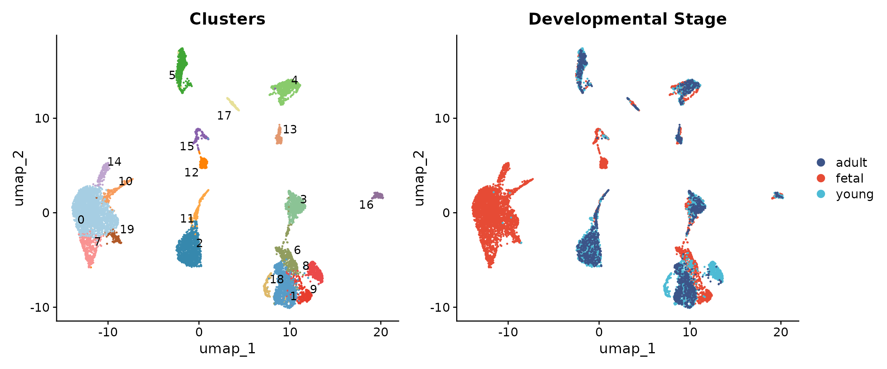

Understanding the developmental composition of each cluster provides
important context for annotation.

``` r
# Calculate cluster composition by group
comp_data <- seu@meta.data %>%
    group_by(seurat_clusters, group) %>%
    summarise(n = n(), .groups = "drop") %>%
    group_by(seurat_clusters) %>%
    mutate(pct = 100 * n / sum(n))

ggplot(comp_data, aes(x = seurat_clusters, y = pct, fill = group)) +
    geom_bar(stat = "identity", position = "stack") +
    scale_fill_manual(values = group_colors) +
    labs(x = "Cluster", y = "Percentage", fill = "Stage",
         title = "Developmental Stage Composition per Cluster") +
    theme_minimal() +
    theme(axis.text.x = element_text(size = 10))
```

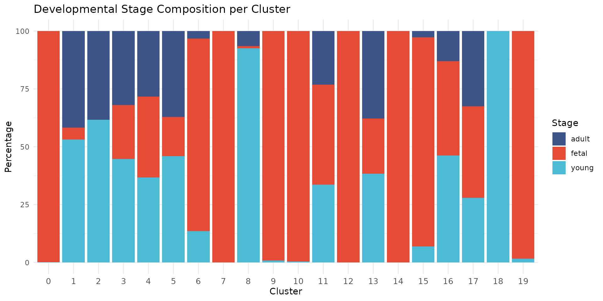

We observe that some clusters are highly enriched for specific
developmental stages. For example, clusters 0, 6, 8, 9, 12, 15, 16, and
17 are nearly exclusively fetal, while cluster 2 contains predominantly
young and adult cells, and cluster 18 is exclusively young. This
developmental segregation often reflects biological differences in cell
state, particularly among cardiomyocytes where fetal cells have distinct
transcriptional profiles from mature cells.

## Find Cluster Markers

We use
[`FindAllMarkers()`](https://satijalab.org/seurat/reference/FindAllMarkers.html)
to identify genes that distinguish each cluster from all other cells.
This is the foundation of marker-based annotation.

``` r
# Set default assay to SCT
DefaultAssay(seu) <- "SCT"

# Prepare for marker finding with SCT assay
seu <- PrepSCTFindMarkers(seu)

# Find markers for all clusters
# We use only.pos = TRUE to find upregulated markers
# min.pct = 0.25 requires the gene to be expressed in at least 25% of cells
# logfc.threshold = 0.5 requires at least 0.5 log2 fold change
markers <- FindAllMarkers(
    seu,
    only.pos = TRUE,
    min.pct = 0.25,
    logfc.threshold = 0.5,
    test.use = "wilcox"
)

cat("Found", nrow(markers), "marker genes across all clusters\n")
```

    ## Found 22502 marker genes across all clusters

Let us examine the top markers for each cluster.

``` r
# Get top 5 markers per cluster
top_markers <- markers %>%
    group_by(cluster) %>%
    slice_max(order_by = avg_log2FC, n = 5) %>%
    select(cluster, gene, avg_log2FC, pct.1, pct.2, p_val_adj)

# Display top markers for each cluster
for (cl in levels(seu$seurat_clusters)) {
    cl_markers <- top_markers %>% filter(cluster == cl)
    cat("\n--- Cluster", cl, "---\n")
    for (i in seq_len(nrow(cl_markers))) {
        cat(sprintf("  %s: log2FC=%.2f, pct.1=%.0f%%, pct.2=%.0f%%\n",
                    cl_markers$gene[i],
                    cl_markers$avg_log2FC[i],
                    cl_markers$pct.1[i] * 100,
                    cl_markers$pct.2[i] * 100))
    }
}
```

    ## 
    ## --- Cluster 0 ---
    ##   LINC02008: log2FC=2.79, pct.1=38%, pct.2=8%
    ##   GALNTL6: log2FC=2.73, pct.1=32%, pct.2=11%
    ##   CUX2: log2FC=2.62, pct.1=57%, pct.2=12%
    ##   GPR39: log2FC=2.59, pct.1=47%, pct.2=8%
    ##   RNF175: log2FC=2.57, pct.1=43%, pct.2=8%
    ## 
    ## --- Cluster 1 ---
    ##   VIT: log2FC=5.54, pct.1=59%, pct.2=3%
    ##   CATSPERB: log2FC=5.16, pct.1=65%, pct.2=4%
    ##   ADH1B: log2FC=5.16, pct.1=79%, pct.2=6%
    ##   CFD: log2FC=5.03, pct.1=79%, pct.2=9%
    ##   MGST1: log2FC=5.01, pct.1=67%, pct.2=5%
    ## 
    ## --- Cluster 2 ---
    ##   LINC01880: log2FC=6.60, pct.1=34%, pct.2=1%
    ##   APOB: log2FC=5.71, pct.1=25%, pct.2=1%
    ##   UGT2B4: log2FC=5.57, pct.1=47%, pct.2=1%
    ##   TMEM178B: log2FC=5.30, pct.1=84%, pct.2=7%
    ##   LINC01428: log2FC=5.18, pct.1=54%, pct.2=2%
    ## 
    ## --- Cluster 3 ---
    ##   AGAP2: log2FC=6.69, pct.1=44%, pct.2=1%
    ##   EGFLAM: log2FC=6.66, pct.1=87%, pct.2=5%
    ##   LINC02237: log2FC=6.41, pct.1=43%, pct.2=2%
    ##   FHL5: log2FC=6.29, pct.1=29%, pct.2=1%
    ##   AVPR1A: log2FC=6.28, pct.1=26%, pct.2=0%
    ## 
    ## --- Cluster 4 ---
    ##   CA4: log2FC=6.82, pct.1=38%, pct.2=1%
    ##   TPO: log2FC=6.74, pct.1=50%, pct.2=3%
    ##   BTNL9: log2FC=6.65, pct.1=70%, pct.2=2%
    ##   TM4SF18: log2FC=6.61, pct.1=32%, pct.2=0%
    ##   NR5A2: log2FC=6.57, pct.1=46%, pct.2=1%
    ## 
    ## --- Cluster 5 ---
    ##   MARCO: log2FC=8.02, pct.1=30%, pct.2=0%
    ##   LILRB5: log2FC=7.57, pct.1=46%, pct.2=1%
    ##   F13A1: log2FC=7.47, pct.1=91%, pct.2=11%
    ##   SIGLEC1: log2FC=7.23, pct.1=65%, pct.2=1%
    ##   FGD2: log2FC=7.04, pct.1=84%, pct.2=2%
    ## 
    ## --- Cluster 6 ---
    ##   PTCH2: log2FC=4.60, pct.1=35%, pct.2=5%
    ##   PTPRT: log2FC=4.51, pct.1=50%, pct.2=10%
    ##   EPHB2: log2FC=4.51, pct.1=53%, pct.2=4%
    ##   ARHGAP20: log2FC=4.40, pct.1=28%, pct.2=3%
    ##   NTRK2: log2FC=4.22, pct.1=51%, pct.2=6%
    ## 
    ## --- Cluster 7 ---
    ##   CSMD1: log2FC=5.39, pct.1=70%, pct.2=18%
    ##   OPCML: log2FC=4.57, pct.1=72%, pct.2=12%
    ##   BRINP3: log2FC=3.68, pct.1=92%, pct.2=24%
    ##   ZMAT4: log2FC=2.93, pct.1=64%, pct.2=16%
    ##   SNAP91: log2FC=2.66, pct.1=32%, pct.2=10%
    ## 
    ## --- Cluster 8 ---
    ##   HLA-DQB1: log2FC=3.97, pct.1=40%, pct.2=3%
    ##   HLA-DPA1: log2FC=3.91, pct.1=54%, pct.2=5%
    ##   HLA-DRA: log2FC=3.59, pct.1=70%, pct.2=7%
    ##   RASD1: log2FC=3.39, pct.1=30%, pct.2=4%
    ##   LAPTM5: log2FC=3.34, pct.1=50%, pct.2=6%
    ## 
    ## --- Cluster 9 ---
    ##   NRG1: log2FC=5.80, pct.1=57%, pct.2=11%
    ##   DCHS2: log2FC=5.52, pct.1=38%, pct.2=2%
    ##   DLK1: log2FC=5.02, pct.1=79%, pct.2=5%
    ##   DSC3: log2FC=4.89, pct.1=60%, pct.2=3%
    ##   NDST4: log2FC=4.87, pct.1=35%, pct.2=2%
    ## 
    ## --- Cluster 10 ---
    ##   CDC45: log2FC=5.36, pct.1=56%, pct.2=2%
    ##   E2F1: log2FC=5.12, pct.1=67%, pct.2=3%
    ##   MCM10: log2FC=5.05, pct.1=52%, pct.2=2%
    ##   DTL: log2FC=5.00, pct.1=84%, pct.2=4%
    ##   BRIP1: log2FC=4.71, pct.1=94%, pct.2=9%
    ## 
    ## --- Cluster 11 ---
    ##   ACTA1: log2FC=4.34, pct.1=51%, pct.2=17%
    ##   S100A1: log2FC=3.97, pct.1=28%, pct.2=5%
    ##   TNNC1: log2FC=3.94, pct.1=87%, pct.2=48%
    ##   CRYAB: log2FC=3.83, pct.1=92%, pct.2=47%
    ##   COX6A2: log2FC=3.70, pct.1=82%, pct.2=32%
    ## 
    ## --- Cluster 12 ---
    ##   PANCR: log2FC=7.54, pct.1=51%, pct.2=1%
    ##   KCNJ3: log2FC=7.22, pct.1=94%, pct.2=2%
    ##   KCNH7: log2FC=6.72, pct.1=87%, pct.2=8%
    ##   ZNF385B: log2FC=6.65, pct.1=86%, pct.2=9%
    ##   VWDE: log2FC=6.60, pct.1=66%, pct.2=1%
    ## 
    ## --- Cluster 13 ---
    ##   PKHD1L1: log2FC=8.70, pct.1=94%, pct.2=3%
    ##   SMOC1: log2FC=6.94, pct.1=70%, pct.2=2%
    ##   MMRN1: log2FC=6.83, pct.1=38%, pct.2=1%
    ##   PCDH15: log2FC=6.61, pct.1=74%, pct.2=12%
    ##   INHBA: log2FC=6.40, pct.1=61%, pct.2=5%
    ## 
    ## --- Cluster 14 ---
    ##   SRARP: log2FC=6.72, pct.1=36%, pct.2=0%
    ##   OTUD1: log2FC=5.50, pct.1=74%, pct.2=5%
    ##   ATF3: log2FC=4.82, pct.1=73%, pct.2=6%
    ##   XIRP1: log2FC=4.54, pct.1=77%, pct.2=11%
    ##   PNMT: log2FC=4.54, pct.1=43%, pct.2=3%
    ## 
    ## --- Cluster 15 ---
    ##   CENPF: log2FC=7.10, pct.1=93%, pct.2=5%
    ##   TROAP: log2FC=7.02, pct.1=62%, pct.2=1%
    ##   PBK: log2FC=7.02, pct.1=81%, pct.2=1%
    ##   KIF18B: log2FC=6.97, pct.1=88%, pct.2=2%
    ##   TOP2A: log2FC=6.96, pct.1=96%, pct.2=4%
    ## 
    ## --- Cluster 16 ---
    ##   NRXN1: log2FC=8.71, pct.1=100%, pct.2=11%
    ##   INSC: log2FC=8.48, pct.1=70%, pct.2=0%
    ##   FOXD3: log2FC=8.44, pct.1=36%, pct.2=0%
    ##   TFAP2A: log2FC=8.41, pct.1=36%, pct.2=0%
    ##   GRIK3: log2FC=8.02, pct.1=58%, pct.2=1%
    ## 
    ## --- Cluster 17 ---
    ##   SKAP1: log2FC=8.15, pct.1=74%, pct.2=3%
    ##   THEMIS: log2FC=7.76, pct.1=41%, pct.2=2%
    ##   ITK: log2FC=7.70, pct.1=59%, pct.2=1%
    ##   CD69: log2FC=7.55, pct.1=36%, pct.2=0%
    ##   SCML4: log2FC=7.55, pct.1=48%, pct.2=1%
    ## 
    ## --- Cluster 18 ---
    ##   CYP19A1: log2FC=4.94, pct.1=38%, pct.2=2%
    ##   LINC01819: log2FC=4.68, pct.1=32%, pct.2=1%
    ##   CILP: log2FC=3.66, pct.1=26%, pct.2=3%
    ##   COL4A4: log2FC=3.61, pct.1=98%, pct.2=20%
    ##   SMIM41: log2FC=3.48, pct.1=26%, pct.2=3%
    ## 
    ## --- Cluster 19 ---
    ##   KRT18: log2FC=3.26, pct.1=30%, pct.2=4%
    ##   MYH7: log2FC=3.08, pct.1=100%, pct.2=64%
    ##   DHFR: log2FC=3.03, pct.1=90%, pct.2=44%
    ##   TNNI1: log2FC=3.02, pct.1=98%, pct.2=34%
    ##   KRT8: log2FC=2.60, pct.1=38%, pct.2=6%

### Visualise Top Markers with DotPlot

The DotPlot below shows the top 5 differentially expressed genes for
each cluster. This provides an unbiased view of what distinguishes each
cluster before we examine the cell type markers from the original study.

``` r
# Get top 5 unique markers per cluster, ordered by cluster
top5_genes <- top_markers %>%
    arrange(cluster, desc(avg_log2FC)) %>%
    pull(gene) %>%
    unique()

DotPlot(seu, features = top5_genes, group.by = "seurat_clusters") +
    RotatedAxis() +
    scale_colour_gradient2(low = "blue", mid = "white", high = "red",
                           midpoint = 0) +
    labs(title = "Top 5 Marker Genes per Cluster (from FindAllMarkers)") +
    theme(axis.text.x = element_text(angle = 90, hjust = 1, vjust = 0.5, size = 7),
          axis.text.y = element_text(size = 10))
```

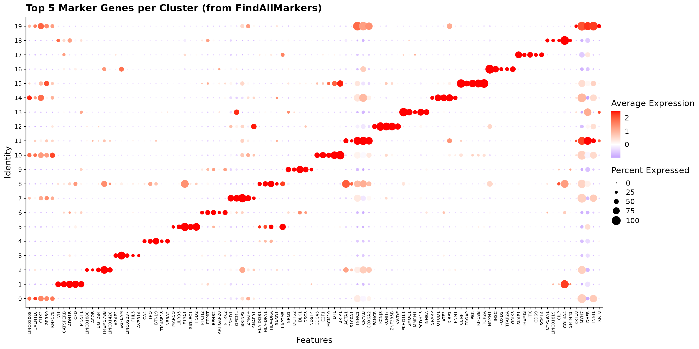

### Marker Heatmap

A heatmap of these top markers provides a comprehensive view of the
expression patterns across clusters.

``` r
# Get top 3 markers per cluster for heatmap
top3_markers <- markers %>%
    group_by(cluster) %>%
    slice_max(order_by = avg_log2FC, n = 3) %>%
    pull(gene) %>%
    unique()

# Downsample for visualisation (50 cells per cluster max)
set.seed(42)
cells_subset <- seu@meta.data %>%
    mutate(cell_id = rownames(seu@meta.data)) %>%
    group_by(seurat_clusters) %>%
    slice_sample(n = 50) %>%
    pull(cell_id)

# Create heatmap
DoHeatmap(subset(seu, cells = cells_subset),
          features = top3_markers,
          group.by = "seurat_clusters",
          size = 3) +
  scale_fill_gradient2(low = "blue", mid = "white", high = "red",
                       midpoint = 0) +
  theme(axis.text.y = element_text(size = 6))
```

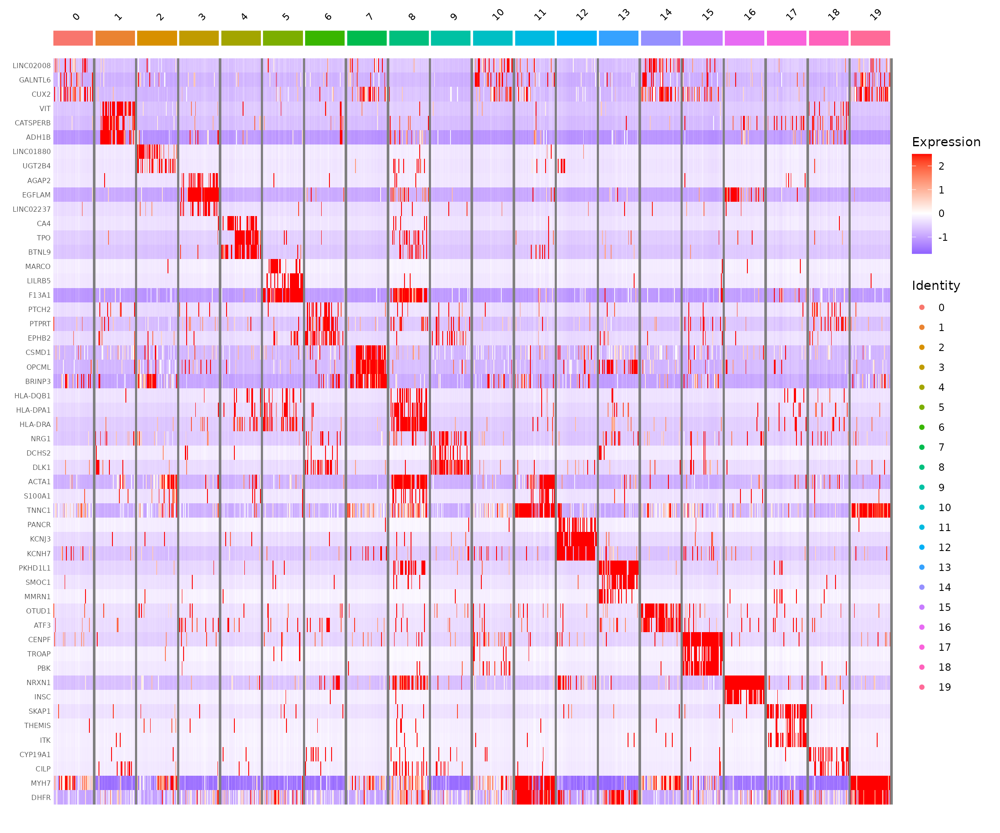

## Cell Type Marker Analysis

While the differentially expressed genes provide a starting point, we
typically compare against known marker genes for the cell types expected
in our tissue. The human heart contains several well-characterised cell
populations.

### Cell Type Marker Genes

The marker genes below were identified by Sim et al. 2021 (Circulation)
from their analysis of the full human heart development dataset. These
markers distinguish the major cell populations across foetal, young, and
adult hearts.

#### Visualise with DotPlot

The DotPlot is a powerful visualisation that shows both the percentage
of cells expressing a gene (dot size) and the average expression level
(colour intensity).

``` r
# Define markers and cell types from Sim et al. 2021
marker_info <- data.frame(
    gene = c(
        # Cardiomyocytes
        "TNNT2", "ACTN2", "TNNI3", "RYR2", "MYH6", "TTN", "MYBPC3", "PLN", "MYL2",
        # Fibroblasts
        "COL1A1", "COL3A1", "DCN", "PDGFRA", "POSTN", "TCF21", "VIM",
        # Pericytes
        "KCNJ8", "VTN", "ABCC9", "HEYL",
        # Endothelial
        "PECAM1", "KDR", "CDH5", "EMCN", "FLT1",
        # Smooth Muscle
        "TAGLN", "MYH11", "MYLK", "LMOD1",
        # Macrophages
        "CD68", "CD163", "CD74", "F13A1", "LGALS3",
        # T Cells
        "CD3D", "CD3G", "CD3E", "IL7R",
        # Schwann/Neural
        "PLP1", "CNP", "S100B",
        # Epicardial
        "UPK3B", "WT1",
        # Proliferating
        "MKI67", "TOP2A"
    ),
    celltype = c(
        rep("Cardiomyocytes", 9),
        rep("Fibroblasts", 7),
        rep("Pericytes", 4),
        rep("Endothelial", 5),
        rep("Smooth Muscle", 4),
        rep("Macrophages", 5),
        rep("T Cells", 4),
        rep("Schwann", 3),
        rep("Epicardial", 2),
        rep("Proliferating", 2)
    )
)

# Define colors for each cell type
celltype_colors <- c(
    "Cardiomyocytes" = "#D62728",
    "Fibroblasts" = "#1F77B4",
    "Pericytes" = "#2CA02C",
    "Endothelial" = "#9467BD",
    "Smooth Muscle" = "#FF7F0E",
    "Macrophages" = "#8C564B",
    "T Cells" = "#E377C2",
    "Schwann" = "#7F7F7F",
    "Epicardial" = "#17BECF",
    "Proliferating" = "#333333"
)

# Filter to available genes
marker_info <- marker_info[marker_info$gene %in% rownames(seu), ]
marker_genes <- marker_info$gene
gene_colors <- celltype_colors[marker_info$celltype]
marker_info$celltype_f <- factor(marker_info$celltype, levels = names(celltype_colors))

# Order clusters by cell type identity for diagonal pattern
# Preferred order based on cell type (CM, Fibroblasts, Pericytes, Endothelial, Immune, Neural, etc.)
preferred_order <- c("0", "6", "8", "17", "7", "9", "2", "11", "15", "1", "12", "3", "5", "13", "18", "4", "14", "16", "10")
# Filter to only clusters that exist in our data
actual_clusters <- as.character(unique(seu$seurat_clusters))
cluster_order <- preferred_order[preferred_order %in% actual_clusters]
# Add any clusters not in preferred order (shouldn't happen, but safety)
cluster_order <- c(cluster_order, setdiff(actual_clusters, cluster_order))
seu$cluster_ordered <- factor(seu$seurat_clusters, levels = cluster_order)

# Calculate cell type label positions
celltype_positions <- marker_info %>%
    mutate(pos = row_number()) %>%
    group_by(celltype_f) %>%
    summarise(start = min(pos) - 0.5, end = max(pos) + 0.5,
              mid = mean(pos), .groups = "drop")

# Create DotPlot with cell type annotations
DotPlot(seu, features = marker_genes, group.by = "cluster_ordered") +
    RotatedAxis() +
    scale_colour_gradient2(low = "#2166AC", mid = "white", high = "#B2182B",
                           midpoint = 0, name = "Average\nExpression") +
    scale_size_continuous(name = "Percent\nExpressed", range = c(0.5, 6)) +
    labs(x = NULL, y = "Cluster",
         title = "Cell Type Marker Expression (Sim et al. 2021)") +
    theme_bw() +
    theme(
        plot.title = element_text(size = 16, face = "bold", hjust = 0.5),
        axis.text.x = element_text(angle = 45, hjust = 1, size = 10,
                                   color = gene_colors, face = "italic"),
        axis.text.y = element_text(size = 12),
        axis.title.y = element_text(size = 14, face = "bold"),
        panel.grid.major = element_blank(),
        panel.grid.minor = element_blank(),
        panel.border = element_rect(color = "grey40", linewidth = 0.8),
        legend.position = "right",
        legend.title = element_text(size = 11, face = "bold"),
        legend.text = element_text(size = 10),
        plot.margin = margin(10, 10, 45, 10)
    ) +
    # Add cell type color bars
    annotate("rect",
             xmin = celltype_positions$start, xmax = celltype_positions$end,
             ymin = -1.8, ymax = -1.2,
             fill = celltype_colors[as.character(celltype_positions$celltype_f)]) +
    # Add cell type labels inside bars
    annotate("text",
             x = celltype_positions$mid, y = -1.5,
             label = celltype_positions$celltype_f,
             size = 3.5, angle = 0, hjust = 0.5, fontface = "bold",
             color = "white") +
    coord_cartesian(clip = "off", ylim = c(0.5, length(cluster_order) + 0.5))
```

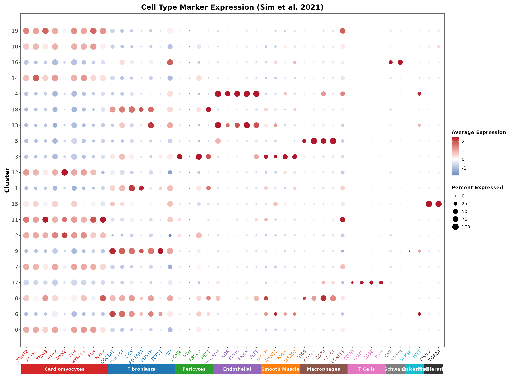

The DotPlot reveals a clear diagonal pattern where each cell type shows
specific marker expression. Gene names are coloured by their cell type,
matching the annotation bar at the bottom:

- **Cardiomyocytes** (red): TNNT2, ACTN2, TNNI3, RYR2, MYH6, TTN,
  MYBPC3, PLN, MYL2
- **Fibroblasts** (blue): COL1A1, COL3A1, DCN, PDGFRA, POSTN, TCF21, VIM
- **Pericytes** (green): KCNJ8, VTN, ABCC9, HEYL
- **Endothelial** (purple): PECAM1, KDR, CDH5, EMCN, FLT1
- **Smooth Muscle** (orange): TAGLN, MYH11, MYLK, LMOD1
- **Macrophages** (brown): CD68, CD163, CD74, F13A1, LGALS3
- **T Cells** (pink): CD3D, CD3G, CD3E, IL7R
- **Schwann** (grey): PLP1, CNP, S100B
- **Epicardial** (teal): UPK3B, WT1
- **Proliferating** (black): MKI67, TOP2A

### Feature Plots for Key Markers

FeaturePlots show the spatial distribution of marker expression on the
UMAP, helping us understand the relationship between clusters.

``` r
# Cardiomyocyte markers
FeaturePlot(seu,
            features = c("TNNT2", "TTN", "MYH7", "MYH6"),
            ncol = 2, order = TRUE) &
    scale_colour_gradient(low = "lightgrey", high = "darkred") &
    theme_minimal()
```

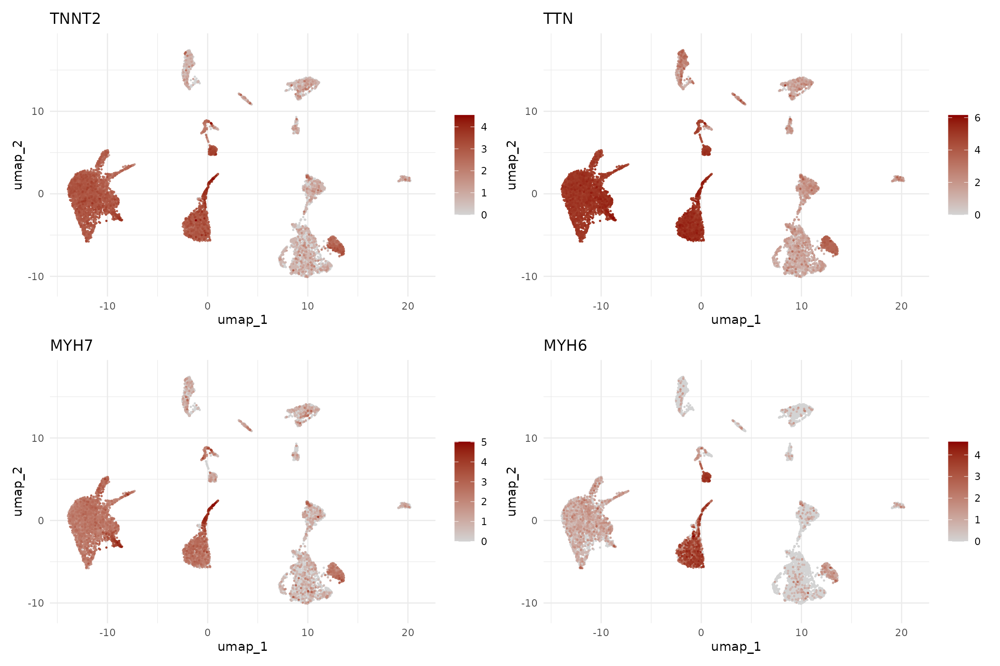

The cardiomyocyte markers reveal an interesting pattern: MYH6 (atrial
isoform) is enriched in clusters 2 and 9, while MYH7 (ventricular
isoform) is more expressed in clusters 0, 11, 15, and 17. This suggests
we can distinguish atrial from ventricular cardiomyocytes.

``` r
# Stromal cell markers
FeaturePlot(seu,
            features = c("DCN", "PECAM1", "KCNJ8", "ACTA2"),
            ncol = 2, order = TRUE) &
    scale_colour_gradient(low = "lightgrey", high = "darkblue") &
    theme_minimal()
```

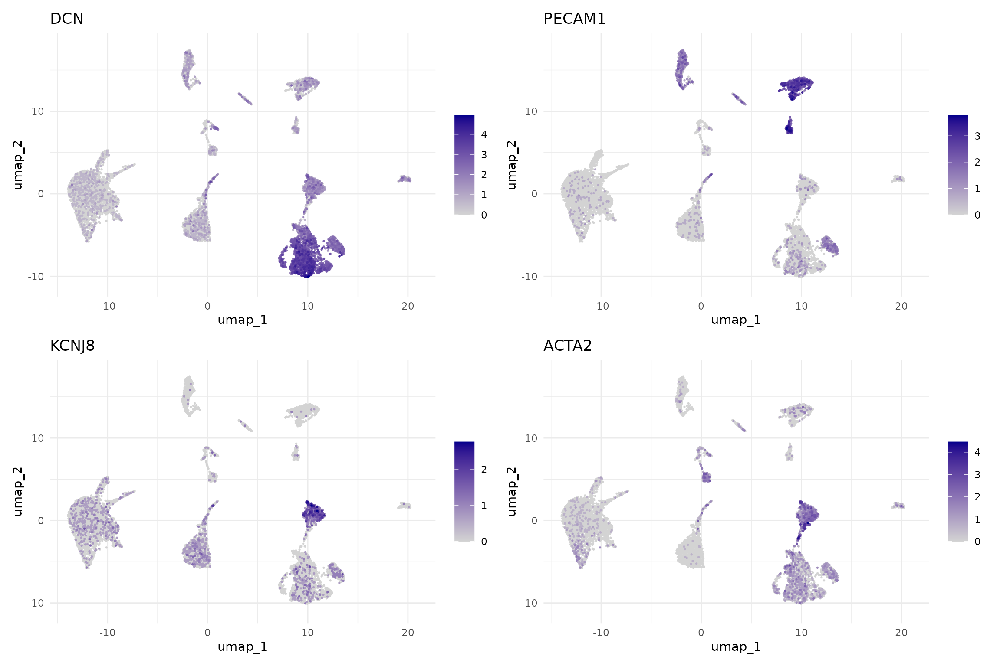

``` r
# Immune and other markers
FeaturePlot(seu,
            features = c("PTPRC", "F13A1", "NRXN1", "MKI67"),
            ncol = 2, order = TRUE) &
    scale_colour_gradient(low = "lightgrey", high = "darkgreen") &
    theme_minimal()
```

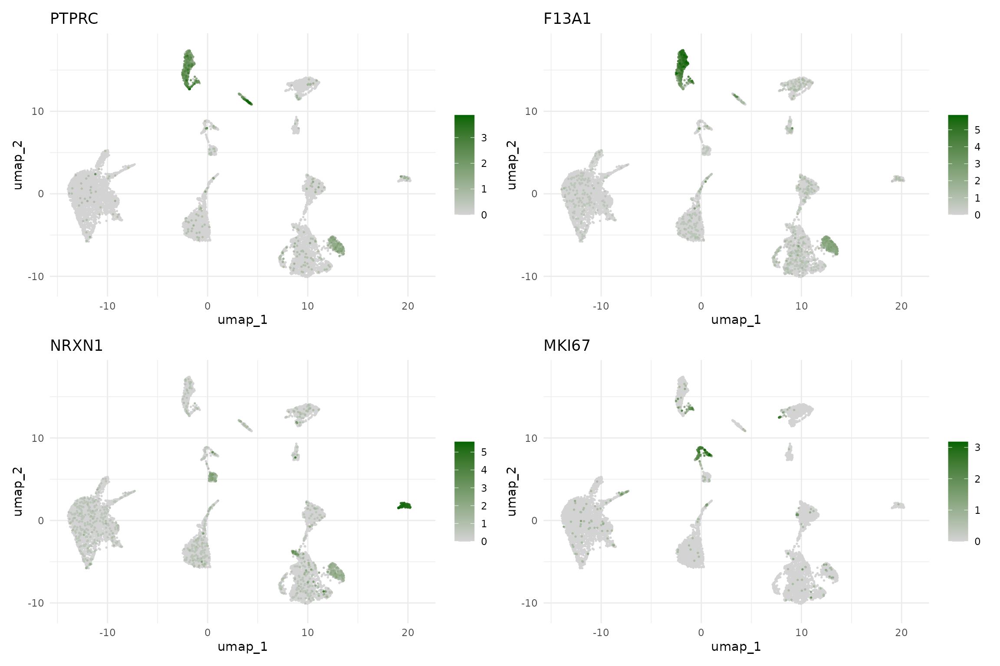

## Assign Cell Type Annotations

Based on the marker analysis above, we can now assign cell type labels
to each cluster. We consider both the marker gene expression and the
developmental stage composition.

**Note:** These annotations are based on the 10,000 cell subset used for
this workshop. The full dataset (~54,000 cells) may reveal additional
rare populations or finer subclusters.

The table below summarises our annotations with the supporting marker
evidence:

| Cluster | Cell Type         | Key Markers            | Notes                                              |
|---------|-------------------|------------------------|----------------------------------------------------|
| 0       | Fetal CM          | TNNT2+, TTN+, MYH7+    | Fetal ventricular cardiomyocytes (100% fetal)      |
| 1       | Fibroblasts       | DCN+, COL1A1+          | Present across all developmental stages            |
| 2       | Atrial CM         | TTN+, MYH6++           | Mature atrial CM (young/adult enriched)            |
| 3       | Pericytes         | KCNJ8+, RGS5+, ABCC9+  | Vascular support cells                             |
| 4       | Macrophages       | CD163+, F13A1+, PTPRC+ | Tissue-resident macrophages                        |
| 5       | Endothelial       | PECAM1+, VWF+, CDH5+   | Main endothelial population                        |
| 6       | Fetal CM          | TNNT2+, TTN+           | Fetal ventricular cardiomyocytes (100% fetal)      |
| 7       | Activated CM      | TTN+, TNNT2+, HLA-DR+  | CM with immune activation/MHC class II (90% young) |
| 8       | Fetal CM          | TNNT2+, TTN+           | Fetal ventricular cardiomyocytes (100% fetal)      |
| 9       | Fetal Atrial CM   | TTN+, MYH6++           | Fetal atrial cardiomyocytes (100% fetal)           |
| 10      | Proliferating     | MKI67+, TOP2A+         | Proliferating cells (fetal enriched)               |
| 11      | Ventricular CM    | TNNT2++, TTN++, MYH7++ | High-expressing ventricular CM                     |
| 12      | Fetal Fibroblasts | DCN+, COL1A1++         | Fetal fibroblasts (99% fetal)                      |
| 13      | Endothelial       | PECAM1+                | Endothelial subset                                 |
| 14      | Immune            | PTPRC+, CD3E+          | Mixed immune/lymphocytes                           |
| 15      | Ventricular CM    | TTN+, MYH7+            | Ventricular CM (fetal enriched)                    |
| 16      | Neurons           | NRXN1++                | Neural cells (100% fetal)                          |
| 17      | Fetal CM          | TNNT2+, TTN++, MYH7+   | Fetal ventricular cardiomyocytes (98% fetal)       |
| 18      | Young Endothelial | PECAM1+, VWF++         | Endothelial cells (100% young)                     |

``` r
# Define cell type annotations for all 19 clusters
cluster_annotations <- c(
  "0" = "Fetal CM",
  "1" = "Fibroblasts",
  "2" = "Atrial CM",
  "3" = "Pericytes",
  "4" = "Macrophages",
  "5" = "Endothelial",
  "6" = "Fetal CM",
  "7" = "Activated CM",
  "8" = "Fetal CM",
  "9" = "Fetal Atrial CM",
  "10" = "Proliferating",
  "11" = "Ventricular CM",
  "12" = "Fetal Fibroblasts",
  "13" = "Endothelial",
  "14" = "Immune",
  "15" = "Ventricular CM",
  "16" = "Neurons",
  "17" = "Fetal CM",
  "18" = "Young Endothelial"
)

cell_type_df <- data.frame(
  cell_type = cluster_annotations[as.character(seu$seurat_clusters)],
  row.names = colnames(seu)
)
seu <- AddMetaData(seu, metadata = cell_type_df)

# Broad categories for summary analyses
broad_annotations <- c(
  "0" = "Cardiomyocytes",
  "1" = "Fibroblasts",
  "2" = "Cardiomyocytes",
  "3" = "Pericytes",
  "4" = "Immune",
  "5" = "Endothelial",
  "6" = "Cardiomyocytes",
  "7" = "Cardiomyocytes",
  "8" = "Cardiomyocytes",
  "9" = "Cardiomyocytes",
  "10" = "Proliferating",
  "11" = "Cardiomyocytes",
  "12" = "Fibroblasts",
  "13" = "Endothelial",
  "14" = "Immune",
  "15" = "Cardiomyocytes",
  "16" = "Neural",
  "17" = "Cardiomyocytes",
  "18" = "Endothelial"
)

cell_type_broad_df <- data.frame(
  cell_type_broad = broad_annotations[as.character(seu$seurat_clusters)],
  row.names = colnames(seu)
)
seu <- AddMetaData(seu, metadata = cell_type_broad_df)
```

## Visualise Annotated Cell Types

With cell type annotations assigned, we now examine the results to
verify our annotations make biological sense and to understand the
cellular composition of the heart across developmental stages.

### Annotated UMAP

The UMAP visualisation with cell type labels provides the key output of
our annotation workflow. We show both detailed annotations
(distinguishing fetal from adult cardiomyocytes, atrial from
ventricular) and broad categories.

``` r
# Define colours for cell types (14 unique detailed types)
celltype_colors <- c(
    "Fetal CM" = "#E64B35",
    "Fibroblasts" = "#00A087",
    "Atrial CM" = "#3C5488",
    "Ventricular CM" = "#4DBBD5",
    "Activated CM" = "#F4A582",
    "Pericytes" = "#F39B7F",
    "Endothelial" = "#8491B4",
    "Macrophages" = "#91D1C2",
    "Fetal Atrial CM" = "#B09C85",
    "Fetal Fibroblasts" = "#00CED1",
    "Neurons" = "#CD534C",
    "Immune" = "#868686",
    "Proliferating" = "#9370DB",
    "Young Endothelial" = "#7570B3"
)

# Broad categories
broad_colors <- c(
    "Cardiomyocytes" = "#E64B35",
    "Fibroblasts" = "#00A087",
    "Endothelial" = "#8491B4",
    "Pericytes" = "#F39B7F",
    "Immune" = "#91D1C2",
    "Neural" = "#CD534C",
    "Proliferating" = "#9370DB"
)

p1 <- DimPlot(seu, group.by = "cell_type", label = TRUE,
              label.size = 3, repel = TRUE) +
    scale_color_manual(values = celltype_colors) +
    ggtitle("Detailed Cell Types") +
    theme(legend.position = "none")

p2 <- DimPlot(seu, group.by = "cell_type_broad", label = TRUE,
              label.size = 4, repel = TRUE) +
    scale_color_manual(values = broad_colors) +
    ggtitle("Broad Cell Types")

p1 + p2
```

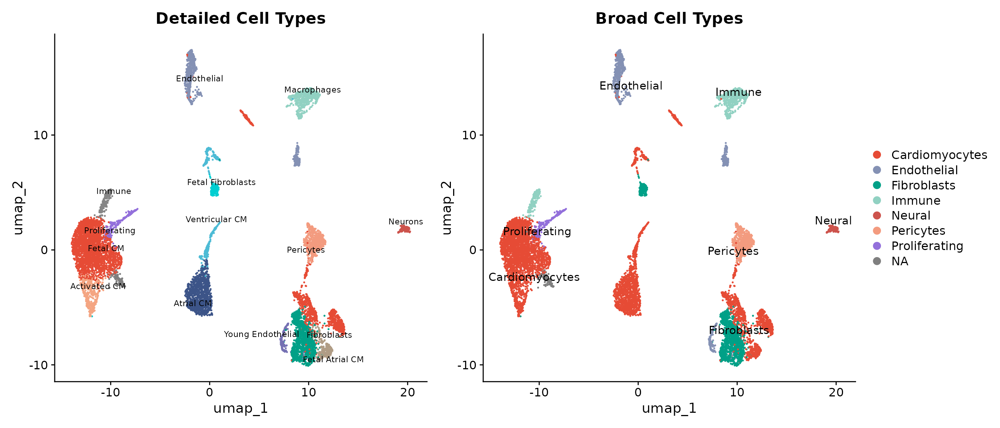

The annotated UMAP reveals a well-organised cellular landscape:

- **Cardiomyocytes** form the dominant population, with fetal cells (red
  tones) clustering separately from mature atrial and ventricular
  populations
- **Stromal cells** (fibroblasts, pericytes, endothelial) occupy
  distinct regions of the UMAP space
- **Immune and neural cells** form smaller but clearly defined clusters

### Cluster Size Distribution

Before examining developmental patterns, we assess how many cells belong
to each cluster. This helps interpret whether observed patterns reflect
genuine biology or sampling effects.

``` r
# Cluster sizes with cell type labels
cluster_size_data <- seu@meta.data %>%
    group_by(seurat_clusters, cell_type) %>%
    summarise(n = n(), .groups = "drop")

ggplot(cluster_size_data, aes(x = seurat_clusters, y = n, fill = cell_type)) +
  geom_bar(stat = "identity") +
  scale_fill_manual(values = celltype_colors) +
  labs(x = "Cluster", y = "Number of Cells", fill = "Cell Type",
       title = "Cell Count per Cluster") +
  theme_minimal() +
  theme(legend.position = "right",
        legend.text = element_text(size = 8))
```

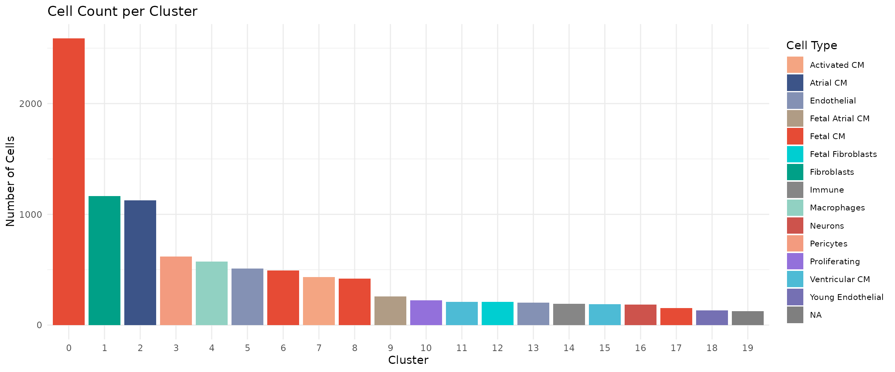

Cluster 0 (Fetal CM) is the largest population with ~2,400 cells,
consistent with fetal samples contributing the most cells. Clusters 16
(Neurons) and 18 (Young Endothelial) are among the smallest,
representing specialised populations.

### Developmental Composition per Cluster

A critical question in developmental studies is: which cell populations
are stage-specific versus shared across development? This stacked bar
chart shows the fetal/young/adult breakdown within each cluster.

``` r
# Calculate developmental composition per cluster
cluster_dev_comp <- seu@meta.data %>%
    group_by(seurat_clusters, group) %>%
    summarise(n = n(), .groups = "drop") %>%
    group_by(seurat_clusters) %>%
    mutate(pct = 100 * n / sum(n))

ggplot(cluster_dev_comp, aes(x = seurat_clusters, y = pct, fill = group)) +
  geom_bar(stat = "identity", position = "stack") +
  scale_fill_manual(values = group_colors) +
  labs(x = "Cluster", y = "Percentage", fill = "Stage",
       title = "Developmental Stage Composition per Cluster") +
  theme_minimal() +
  theme(axis.text.x = element_text(size = 10))
```

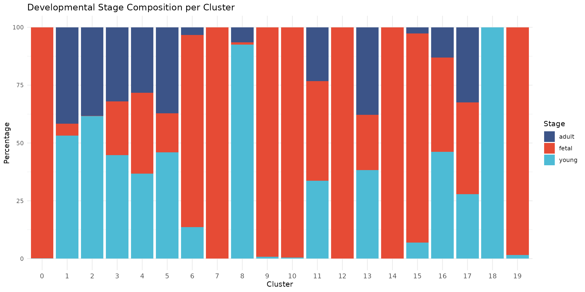

This figure reveals striking developmental patterns:

- **Fetal-specific clusters** (0, 6, 8, 9, 12, 16, 17): These
  cardiomyocyte, fibroblast, and neural populations are almost
  exclusively fetal, reflecting the distinct transcriptional state of
  immature heart cells
- **Mature CM clusters** (2, 11, 15): Atrial and ventricular CM clusters
  contain cells from all stages, with cluster 2 enriched for young and
  adult cells
- **Activated CM** (7): Cardiomyocytes with MHC class II expression,
  predominantly from young samples, potentially reflecting immune
  activation
- **Young-enriched endothelial** (18): Endothelial cells exclusively
  from young samples
- **Shared populations** (1, 3, 4, 5, 13, 14): Fibroblasts, pericytes,
  immune, and endothelial cells are present across all developmental
  stages
- **Proliferating cells** (10): Nearly exclusively fetal, consistent
  with the high proliferative capacity of fetal cardiac cells

### Cell Type Composition by Developmental Stage

We can also view this relationship from the opposite perspective: what
is the cellular composition within each developmental stage?

``` r
# Calculate composition
stage_comp <- seu@meta.data %>%
    group_by(group, cell_type_broad) %>%
    summarise(n = n(), .groups = "drop") %>%
    group_by(group) %>%
    mutate(pct = 100 * n / sum(n))

ggplot(stage_comp, aes(x = group, y = pct, fill = cell_type_broad)) +
    geom_bar(stat = "identity", position = "stack") +
    scale_fill_manual(values = broad_colors) +
    labs(x = "Developmental Stage", y = "Percentage", fill = "Cell Type",
         title = "Cell Type Composition by Developmental Stage") +
    theme_minimal()
```

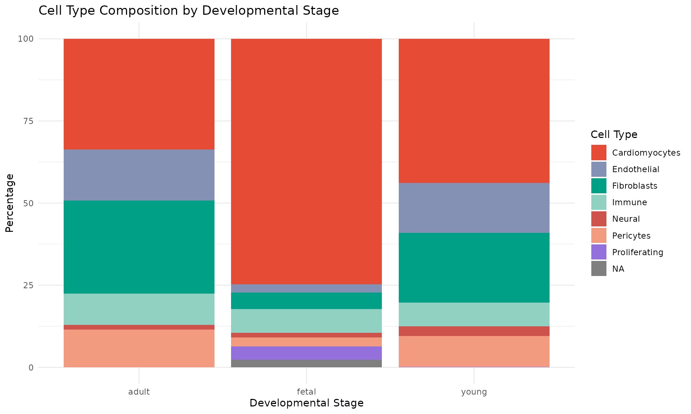

This complementary view shows:

- **Cardiomyocytes** dominate all stages but show distinct subtypes
  (fetal vs mature)
- **Proliferating cells** are predominantly fetal, consistent with the
  known proliferative capacity of fetal cardiomyocytes
- **Stromal populations** (fibroblasts, endothelial, pericytes) are
  relatively stable across development

### Split UMAP by Developmental Stage

Finally, we split the UMAP by developmental stage to directly visualise
which cell types are present at each time point. This view clearly shows
how the cellular landscape changes from fetal to adult heart.

``` r
DimPlot(seu, group.by = "cell_type", split.by = "group",
        label = FALSE, cols = celltype_colors) +
  ggtitle("Cell Types by Developmental Stage") +
  theme(legend.position = "right",
        legend.text = element_text(size = 8))
```

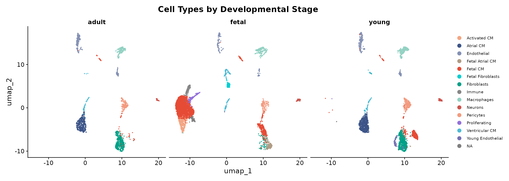

The split view highlights several key observations:

- **Fetal heart** is dominated by Fetal CM populations, with
  proliferating cells visible (cluster 10)
- **Young heart** shows a transition state with both mature
  atrial/ventricular CM and some residual fetal-like populations
- **Adult heart** shows predominantly mature cardiomyocyte subtypes
  (Atrial and Ventricular CM)
- **Stromal and immune populations** are consistent across all stages

## Save Annotated Object

``` r
# Create results directory if it doesn't exist
dir.create("../results", recursive = TRUE, showWarnings = FALSE)

# Save the annotated Seurat object
saveRDS(seu, "../data/processed/03_annotated.rds")

# Also save the markers table
write.csv(markers, "../results/cluster_markers.csv", row.names = FALSE)

message("Saved annotated object to: data/processed/03_annotated.rds")
message("Saved marker genes to: results/cluster_markers.csv")
```

## Summary

In this module, we performed cell type annotation on the clustered data.
We:

- Identified marker genes for each cluster using
  [`FindAllMarkers()`](https://satijalab.org/seurat/reference/FindAllMarkers.html)
- Compared cluster markers against known heart cell type markers from
  Sim et al. 2021
- Visualised marker expression using DotPlots and FeaturePlots
- Assigned cell type labels based on marker gene expression and
  developmental composition
- Created both detailed (14 types) and broad (7 types) cell type
  annotations

The annotated dataset is now ready for differential expression and
composition analysis in Module 4.

## Session Information

``` r
sessionInfo()
```

    ## R version 4.5.2 (2025-10-31)
    ## Platform: x86_64-pc-linux-gnu
    ## Running under: Ubuntu 24.04.3 LTS
    ## 
    ## Matrix products: default
    ## BLAS:   /usr/lib/x86_64-linux-gnu/openblas-pthread/libblas.so.3 
    ## LAPACK: /usr/lib/x86_64-linux-gnu/openblas-pthread/libopenblasp-r0.3.26.so;  LAPACK version 3.12.0
    ## 
    ## locale:
    ##  [1] LC_CTYPE=C.UTF-8       LC_NUMERIC=C           LC_TIME=C.UTF-8       
    ##  [4] LC_COLLATE=C.UTF-8     LC_MONETARY=C.UTF-8    LC_MESSAGES=C.UTF-8   
    ##  [7] LC_PAPER=C.UTF-8       LC_NAME=C              LC_ADDRESS=C          
    ## [10] LC_TELEPHONE=C         LC_MEASUREMENT=C.UTF-8 LC_IDENTIFICATION=C   
    ## 
    ## time zone: UTC
    ## tzcode source: system (glibc)
    ## 
    ## attached base packages:
    ## [1] stats     graphics  grDevices datasets  utils     methods   base     
    ## 
    ## other attached packages:
    ## [1] pheatmap_1.0.13    RColorBrewer_1.1-3 patchwork_1.3.2    tidyr_1.3.2       
    ## [5] dplyr_1.1.4        ggplot2_4.0.1      Seurat_5.4.0       SeuratObject_5.3.0
    ## [9] sp_2.2-0          
    ## 
    ## loaded via a namespace (and not attached):
    ##   [1] deldir_2.0-4           pbapply_1.7-4          gridExtra_2.3         
    ##   [4] rlang_1.1.7            magrittr_2.0.4         RcppAnnoy_0.0.23      
    ##   [7] otel_0.2.0             spatstat.geom_3.6-1    matrixStats_1.5.0     
    ##  [10] ggridges_0.5.7         compiler_4.5.2         png_0.1-8             
    ##  [13] systemfonts_1.3.1      vctrs_0.6.5            reshape2_1.4.5        
    ##  [16] stringr_1.6.0          pkgconfig_2.0.3        fastmap_1.2.0         
    ##  [19] labeling_0.4.3         promises_1.5.0         rmarkdown_2.30        
    ##  [22] ragg_1.5.0             purrr_1.2.1            xfun_0.55             
    ##  [25] cachem_1.1.0           jsonlite_2.0.0         goftest_1.2-3         
    ##  [28] later_1.4.5            spatstat.utils_3.2-1   irlba_2.3.5.1         
    ##  [31] parallel_4.5.2         cluster_2.1.8.1        R6_2.6.1              
    ##  [34] ica_1.0-3              spatstat.data_3.1-9    stringi_1.8.7         
    ##  [37] bslib_0.9.0            limma_3.66.0           reticulate_1.44.1     
    ##  [40] spatstat.univar_3.1-5  parallelly_1.46.1      lmtest_0.9-40         
    ##  [43] jquerylib_0.1.4        scattermore_1.2        Rcpp_1.1.1            
    ##  [46] knitr_1.51             tensor_1.5.1           future.apply_1.20.1   
    ##  [49] zoo_1.8-15             sctransform_0.4.3      httpuv_1.6.16         
    ##  [52] Matrix_1.7-4           splines_4.5.2          igraph_2.2.1          
    ##  [55] tidyselect_1.2.1       abind_1.4-8            yaml_2.3.12           
    ##  [58] spatstat.random_3.4-3  spatstat.explore_3.6-0 codetools_0.2-20      
    ##  [61] miniUI_0.1.2           listenv_0.10.0         plyr_1.8.9            
    ##  [64] lattice_0.22-7         tibble_3.3.1           withr_3.0.2           
    ##  [67] shiny_1.12.1           S7_0.2.1               ROCR_1.0-11           
    ##  [70] evaluate_1.0.5         Rtsne_0.17             future_1.68.0         
    ##  [73] fastDummies_1.7.5      desc_1.4.3             survival_3.8-3        
    ##  [76] polyclip_1.10-7        fitdistrplus_1.2-4     pillar_1.11.1         
    ##  [79] BiocManager_1.30.27    KernSmooth_2.23-26     renv_1.1.5            
    ##  [82] plotly_4.11.0          generics_0.1.4         RcppHNSW_0.6.0        
    ##  [85] scales_1.4.0           globals_0.18.0         xtable_1.8-4          
    ##  [88] glue_1.8.0             lazyeval_0.2.2         tools_4.5.2           
    ##  [91] data.table_1.18.0      RSpectra_0.16-2        RANN_2.6.2            
    ##  [94] fs_1.6.6               dotCall64_1.2          cowplot_1.2.0         
    ##  [97] grid_4.5.2             nlme_3.1-168           cli_3.6.5             
    ## [100] spatstat.sparse_3.1-0  textshaping_1.0.4      spam_2.11-3           
    ## [103] viridisLite_0.4.2      uwot_0.2.4             gtable_0.3.6          
    ## [106] sass_0.4.10            digest_0.6.39          progressr_0.18.0      
    ## [109] ggrepel_0.9.6          htmlwidgets_1.6.4      farver_2.1.2          
    ## [112] htmltools_0.5.9        pkgdown_2.2.0          lifecycle_1.0.5       
    ## [115] httr_1.4.7             statmod_1.5.1          mime_0.13             
    ## [118] MASS_7.3-65
