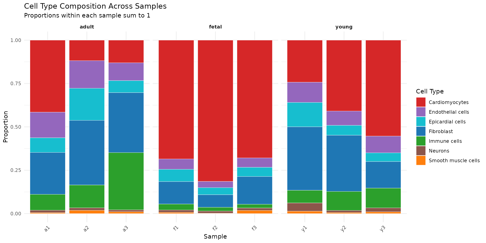
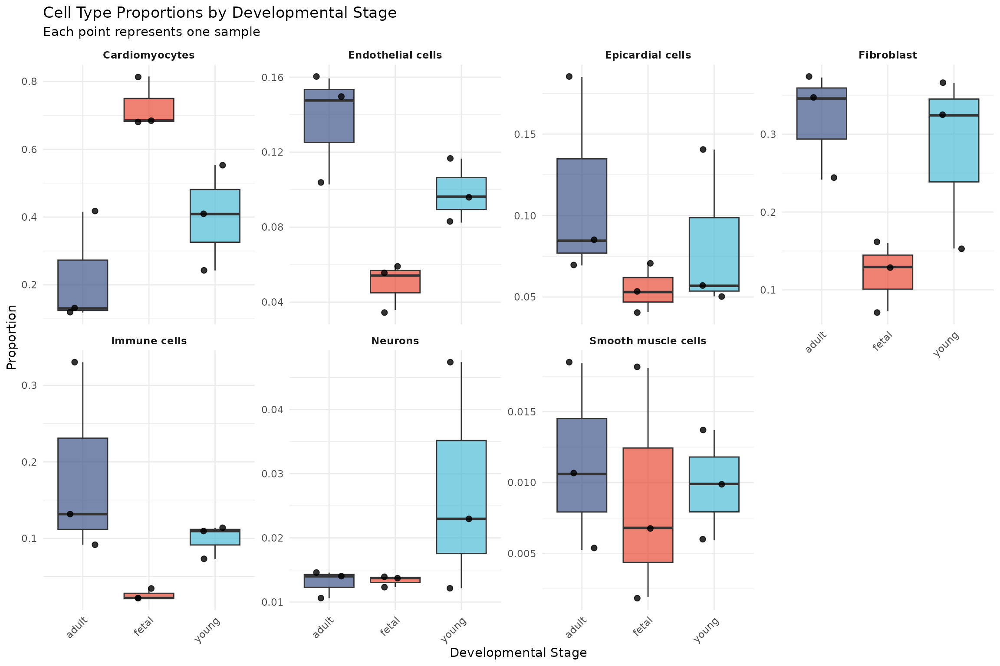
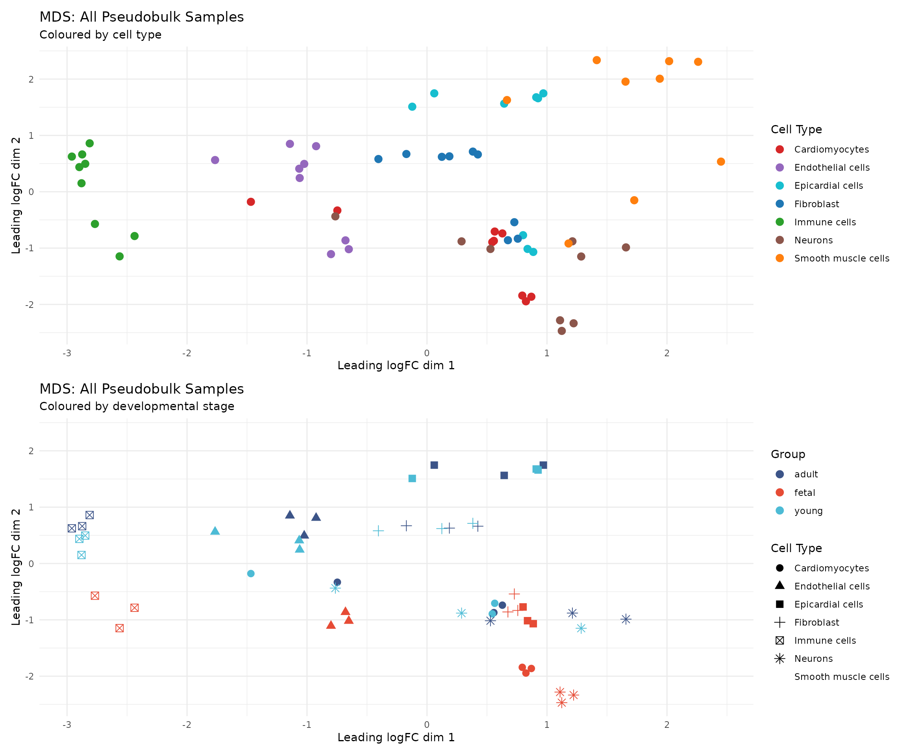
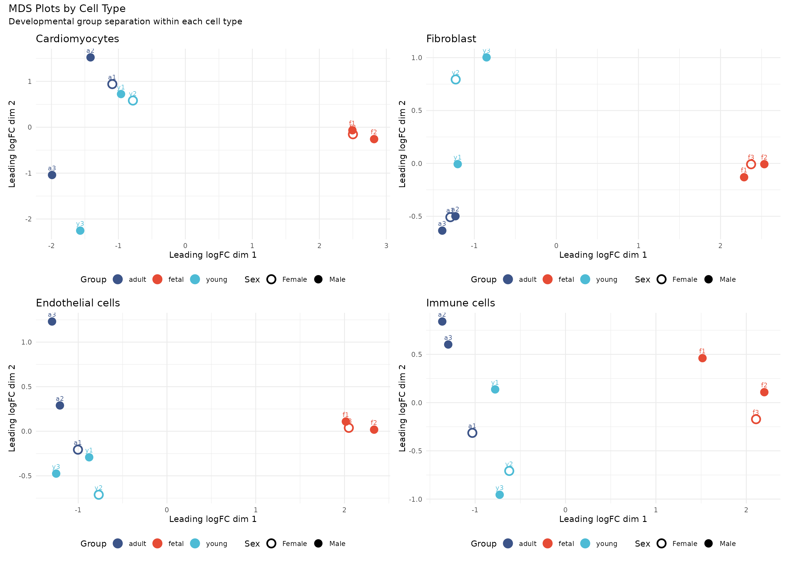
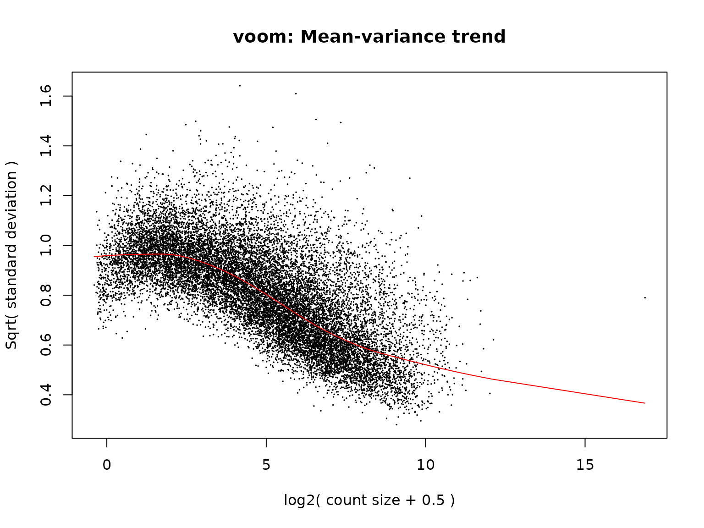
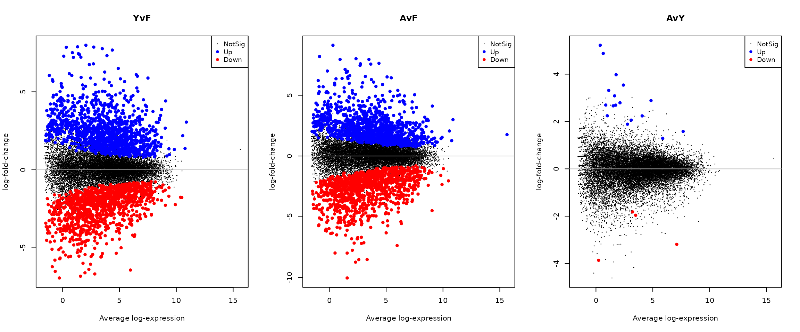
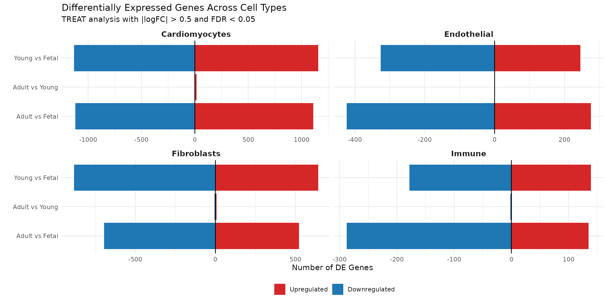
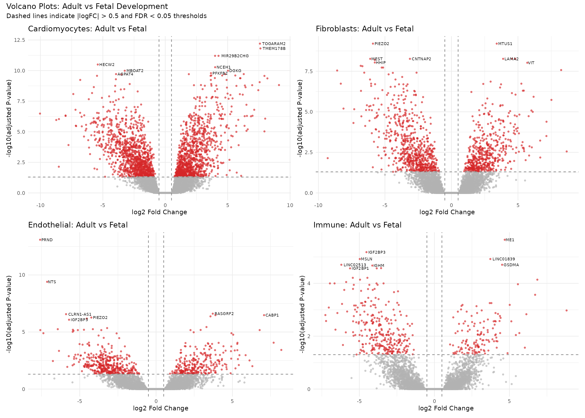
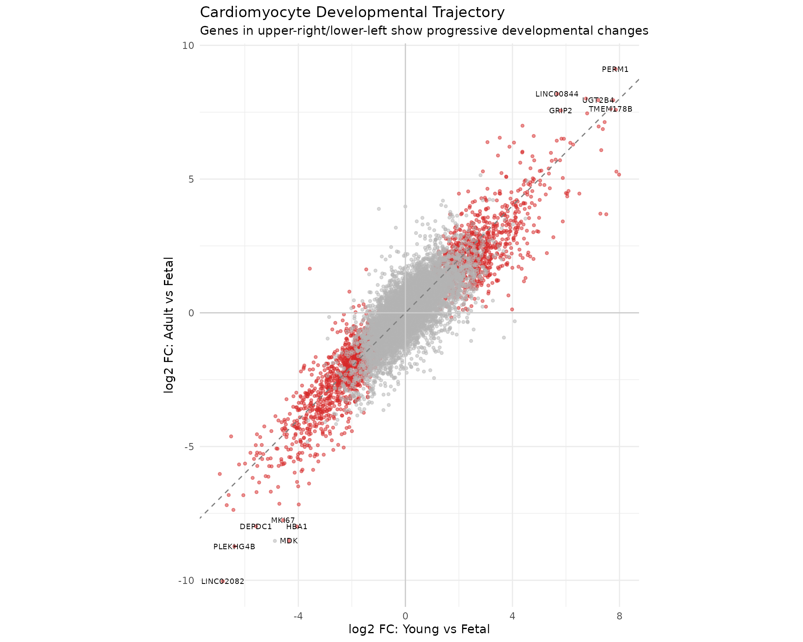

# Module 4: Differential Expression Analysis

## Introduction

Differential expression (DE) analysis identifies genes whose expression
levels differ significantly between experimental conditions. In single
cell studies, this typically involves comparing gene expression across
developmental stages, disease states, or treatment conditions. However,
the statistical approach requires careful consideration of the study
design.

### About This Dataset

The data we are analysing comes from the study by Sim et al. (2021)
published in *Circulation*, titled “Sex-Specific Control of Human Heart
Maturation by the Progesterone Receptor”. This study performed
single-nucleus RNA sequencing (snRNA-seq) of 54,140 nuclei from 9 human
donors to profile transcriptional changes during heart maturation from
fetal stages to adulthood. The original study identified:

- **Cell type composition changes**: A significant expansion of cardiac
  fibroblasts and immune cells in the postnatal heart, accompanied by a
  decrease in cardiomyocyte proportions
- **Transcriptional maturation**: Profound changes in all cardiac cell
  types, with the largest number of differentially expressed genes in
  cardiomyocytes
- **Sex-specific programmes**: Sexually dimorphic gene expression that
  emerges primarily during adulthood
- **Metabolic maturation**: Cardiomyocyte maturation was associated with
  repression of cell cycle genes and activation of oxidative
  phosphorylation and respiratory electron transport pathways

In this module, we will reproduce key aspects of this analysis using the
pseudobulk differential expression approach employed in the original
study.

### The Pseudoreplication Problem

A critical pitfall in single cell differential expression analysis is
**pseudoreplication**: treating cells as independent biological
replicates when they are not. Cells from the same sample share technical
and biological variation that violates the independence assumption of
statistical tests.

Consider this analogy: if we want to compare heights between two
populations, measuring the same person multiple times does not increase
our sample size. Similarly, capturing 5,000 cells from one individual
does not give us 5,000 independent observations of that individual’s
biology.

Many single cell DE methods (Wilcoxon test, t-test, MAST) operate at the
cell level and treat each cell as an independent replicate. These
approaches:

- **Inflate Type I error rates** (false positives) dramatically
- **Produce artificially small p-values** that do not reflect true
  significance
- **Confound biological with technical variation**
- **Cannot generalise findings** beyond the specific samples analysed

The solution is **pseudobulk analysis**: aggregating counts across cells
within each sample to create sample-level expression estimates, then
applying well-established bulk RNA-seq methods. This approach:

- **Correctly identifies the biological replicate** (the
  sample/individual)
- **Properly controls false discovery rates**
- **Accounts for sample-to-sample variation**
- **Produces results that generalise to the population**

### Study Design Considerations

Our dataset contains 9 samples across 3 developmental stages:

| Group | Samples    | Sex Distribution |
|-------|------------|------------------|
| Fetal | f1, f2, f3 | 2 male, 1 female |
| Young | y1, y2, y3 | 2 male, 1 female |
| Adult | a1, a2, a3 | 1 male, 2 female |

With n=3 per group, statistical power is limited. This is a common
constraint in single cell studies due to the cost of sample collection
and sequencing. We must interpret results with appropriate caution and
avoid over-claiming the significance of findings.

The unbalanced sex distribution across groups is another consideration.
We address this by including sex in our statistical model, though the
small sample sizes limit our ability to fully disentangle sex and
developmental effects.

### Learning Objectives

By the end of this module, you will be able to:

1.  Understand why pseudobulk analysis is necessary for single cell DE
2.  Perform appropriate gene filtering for DE analysis
3.  Create pseudobulk expression matrices stratified by cell type and
    sample
4.  Apply the limma-voom pipeline for differential expression
5.  Interpret and visualise DE results critically
6.  Understand the limitations imposed by sample size

## Load Libraries

``` r
library(Seurat)
library(edgeR)
library(limma)
library(speckle)        # For propeller cell type composition analysis
library(org.Hs.eg.db)
library(AnnotationDbi)
library(ggplot2)
library(dplyr)
library(tidyr)
library(RColorBrewer)
library(pheatmap)
library(patchwork)
```

## Load Data

We load the QC-filtered Seurat object from Module 1, which contains
cells that passed our quality control criteria. The pseudobulk approach
aggregates raw counts, so we extract the count matrix from the RNA
assay. Cell type labels come from the original study annotations in
`cellinfo_updated.Rds`.

``` r
data_dir <- "../data"

# Load QC-filtered Seurat object from Module 1
seu <- readRDS(file.path(data_dir, "processed/01_qc_filtered.rds"))

# Extract raw counts (not normalised - pseudobulk uses raw counts)
counts <- GetAssayData(seu, assay = "RNA", layer = "counts")

# Load cell metadata with cell type annotations from original study
cellinfo <- readRDS(file.path(data_dir, "cellinfo_updated.Rds"))

# Match cellinfo to QC-filtered cells
cellinfo <- cellinfo[match(colnames(seu), cellinfo$CellID), ]

cat("QC-filtered dataset:\n")
```

    ## QC-filtered dataset:

``` r
cat("- Genes:", format(nrow(counts), big.mark = ","), "\n")
```

    ## - Genes: 18,953

``` r
cat("- Cells:", format(ncol(counts), big.mark = ","), "\n")
```

    ## - Cells: 47,405

### Examine Cell Type Labels

The cell metadata contains cell type annotations from the original
study. We use the `Celltype` column which provides broad cell type
classifications:

``` r
# Cell type distribution in QC-filtered data
cat("Cell type distribution:\n")
```

    ## Cell type distribution:

``` r
print(table(cellinfo$Celltype))
```

    ## 
    ##      Cardiomyocytes   Endothelial cells    Epicardial cells           Erythroid 
    ##               26677                3727                3397                  56 
    ##          Fibroblast        Immune cells             Neurons Smooth muscle cells 
    ##                9160                3145                 818                 425

``` r
# Cell type by developmental stage
cat("\nCell type by developmental stage:\n")
```

    ## 
    ## Cell type by developmental stage:

``` r
print(table(cellinfo$Celltype, cellinfo$Group))
```

    ##                      
    ##                       adult fetal young
    ##   Cardiomyocytes       2129 18957  5591
    ##   Endothelial cells    1131  1250  1346
    ##   Epicardial cells      905  1381  1111
    ##   Erythroid               0    56     0
    ##   Fibroblast           2361  2974  3825
    ##   Immune cells         1114   662  1369
    ##   Neurons               107   341   370
    ##   Smooth muscle cells    82   209   134

### Define Colour Palettes

``` r
# Developmental group colours
group_colors <- c(
    "fetal" = "#E64B35",
    "young" = "#4DBBD5",
    "adult" = "#3C5488"
)

# Cell type colours
celltype_colors <- c(
    "Cardiomyocytes" = "#D62728",
    "Fibroblast" = "#1F77B4",
    "Endothelial cells" = "#9467BD",
    "Immune cells" = "#2CA02C",
    "Smooth muscle cells" = "#FF7F0E",
    "Epicardial cells" = "#17BECF",
    "Neurons" = "#8C564B",
    "Erythroid" = "#E377C2"
)
```

### Gene Annotation

We retrieve gene annotations for displaying results (gene names in
output tables). Note that gene filtering was already performed in Module
1.

``` r
# Get gene annotation for output tables
gene_symbols <- rownames(counts)

ann <- AnnotationDbi::select(
  org.Hs.eg.db,
  keys = gene_symbols,
  columns = c("SYMBOL", "ENTREZID", "GENENAME"),
  keytype = "SYMBOL"
)

# Handle genes with multiple mappings
ann <- ann[!duplicated(ann$SYMBOL), ]
ann <- ann[match(gene_symbols, ann$SYMBOL), ]

cat("Genes with annotation:", sum(!is.na(ann$GENENAME)), "/", length(gene_symbols), "\n")
```

    ## Genes with annotation: 18953 / 18953

## Prepare Data for Pseudobulk Analysis

Quality control (cell and gene filtering) was completed in Module 1. We
now prepare the data for pseudobulk differential expression analysis.

### Exclude Erythroid Cells

Erythroid cells represent a small population that may be contaminants.
We exclude them from DE analysis:

``` r
# Check for erythroid cells
n_erythroid <- sum(cellinfo$Celltype == "Erythroid", na.rm = TRUE)
cat("Erythroid cells found:", n_erythroid, "\n")
```

    ## Erythroid cells found: 56

``` r
# Remove erythroid cells if present
if (n_erythroid > 0) {
  cells_keep <- cellinfo$Celltype != "Erythroid"
  cellinfo_filtered <- cellinfo[cells_keep, ]
  counts_filtered <- counts[, cells_keep]
} else {
  cellinfo_filtered <- cellinfo
  counts_filtered <- counts
}

cat("Cells for DE analysis:", ncol(counts_filtered), "\n")
```

    ## Cells for DE analysis: 47349

``` r
cat("\nCell type distribution:\n")
```

    ## 
    ## Cell type distribution:

``` r
print(table(cellinfo_filtered$Celltype))
```

    ## 
    ##      Cardiomyocytes   Endothelial cells    Epicardial cells          Fibroblast 
    ##               26677                3727                3397                9160 
    ##        Immune cells             Neurons Smooth muscle cells 
    ##                3145                 818                 425

> **Note:** Gene filtering (mitochondrial, ribosomal, sex chromosome,
> and unannotated genes) was performed in Module 1. Filtering of lowly
> expressed genes is performed later using
> [`edgeR::filterByExpr()`](https://rdrr.io/pkg/edgeR/man/filterByExpr.html),
> which applies appropriate thresholds based on the pseudobulk sample
> structure.

## Cell Type Composition Analysis

Before examining gene expression changes, we first ask: **does the
cellular composition of the heart change during development?** This is
an important biological question because changes in cell type
proportions can:

- Reflect biological processes such as cell proliferation, migration, or
  death
- Influence tissue function independently of gene expression changes
- Confound bulk RNA-seq analysis (where expression changes may simply
  reflect composition changes)

The original study by Sim et al. (2021) found that cardiac maturation
was associated with a significant expansion in the relative proportion
of cardiac fibroblasts and immune cells, accompanied by a significant
decrease in the proportion of cardiomyocytes (Figure 1C in the paper).
We can test this using the **propeller** method from the *speckle*
package.

### Why Use propeller?

Cell type proportions are **compositional data**: they must sum to 1
within each sample. This creates dependencies between cell types—if one
proportion increases, others must decrease. Standard statistical tests
(t-tests, ANOVA) ignore this constraint and can produce misleading
results.

The [`propeller()`](https://rdrr.io/pkg/speckle/man/propeller.html)
function addresses this by:

1.  Applying appropriate transformations to proportional data
2.  Using empirical Bayes moderation for robust variance estimation
3.  Properly accounting for the nested structure (cells within samples)

### Calculate Cell Type Proportions

``` r
# Calculate cell counts per sample and cell type
composition_data <- cellinfo_filtered %>%
  group_by(Sample, Group, Celltype) %>%
  summarise(n_cells = n(), .groups = "drop") %>%
  group_by(Sample) %>%
  mutate(
    total_cells = sum(n_cells),
    proportion = n_cells / total_cells
  ) %>%
  ungroup()

# Display summary
cat("Cells per sample:\n")
```

    ## Cells per sample:

``` r
composition_data %>%
  select(Sample, Group, total_cells) %>%
  distinct() %>%
  print()
```

    ## # A tibble: 9 × 3
    ##   Sample Group total_cells
    ##   <chr>  <chr>       <int>
    ## 1 a1     adult        3998
    ## 2 a2     adult        2605
    ## 3 a3     adult        1226
    ## 4 f1     fetal        7935
    ## 5 f2     fetal       10369
    ## 6 f3     fetal        7470
    ## 7 y1     young        4306
    ## 8 y2     young        4695
    ## 9 y3     young        4745

### Visualise Composition Changes

``` r
# Stacked bar plot of cell type proportions
ggplot(composition_data, aes(x = Sample, y = proportion, fill = Celltype)) +
  geom_bar(stat = "identity", colour = "white", linewidth = 0.2) +
  scale_fill_manual(values = celltype_colors) +
  facet_grid(~ Group, scales = "free_x", space = "free_x") +
  labs(
    title = "Cell Type Composition Across Samples",
    subtitle = "Proportions within each sample sum to 1",
    x = "Sample",
    y = "Proportion",
    fill = "Cell Type"
  ) +
  theme_minimal() +
  theme(
    legend.position = "right",
    axis.text.x = element_text(angle = 45, hjust = 1),
    strip.text = element_text(face = "bold")
  )
```



``` r
# Boxplot of cell type proportions by developmental stage
ggplot(composition_data, aes(x = Group, y = proportion, fill = Group)) +
  geom_boxplot(outlier.shape = NA, alpha = 0.7) +
  geom_jitter(width = 0.2, size = 2, alpha = 0.8) +
  scale_fill_manual(values = group_colors) +
  facet_wrap(~ Celltype, scales = "free_y", ncol = 4) +
  labs(
    title = "Cell Type Proportions by Developmental Stage",
    subtitle = "Each point represents one sample",
    x = "Developmental Stage",
    y = "Proportion"
  ) +
  theme_minimal() +
  theme(
    legend.position = "none",
    strip.text = element_text(face = "bold"),
    axis.text.x = element_text(angle = 45, hjust = 1)
  )
```



**Interpretation**: Visual inspection suggests that cardiomyocyte
proportions decrease from fetal to adult stages, while fibroblast and
immune cell proportions appear to increase. However, we need formal
statistical testing to determine whether these differences are
significant given the sample variability.

### Statistical Testing with propeller

The [`propeller()`](https://rdrr.io/pkg/speckle/man/propeller.html)
function tests for differences in cell type proportions between groups
while properly handling the compositional nature of the data:

``` r
# Prepare data for propeller
# Need vectors of: clusters (cell types), samples, and groups
clusters <- cellinfo_filtered$Celltype
samples <- cellinfo_filtered$Sample

# Map samples to groups
sample_to_group <- cellinfo_filtered %>%
  select(Sample, Group) %>%
  distinct() %>%
  { setNames(.$Group, .$Sample) }
groups <- sample_to_group[samples]

# Run propeller test comparing developmental groups
# This tests whether cell type proportions differ between fetal, young, and adult
propeller_results <- propeller(
  clusters = clusters,
  sample = samples,
  group = groups
)

# Display results
cat("Propeller Test Results: Cell Type Composition Changes\n")
```

    ## Propeller Test Results: Cell Type Composition Changes

``` r
cat("======================================================\n\n")
```

    ## ======================================================

``` r
print(propeller_results)
```

    ##                     BaselineProp PropMean.adult PropMean.fetal PropMean.young
    ## Cardiomyocytes       0.563412110     0.22139920    0.726306287    0.401684990
    ## Immune cells         0.066421677     0.18451941    0.025994487    0.098811970
    ## Fibroblast           0.193457095     0.32006855    0.120641229    0.281129831
    ## Endothelial cells    0.078713384     0.13655202    0.049910648    0.098440512
    ## Neurons              0.017275972     0.01306597    0.013334485    0.027495960
    ## Epicardial cells     0.071743859     0.11296741    0.054877394    0.082579815
    ## Smooth muscle cells  0.008975902     0.01142744    0.008935469    0.009856922
    ##                     Fstatistic      P.Value         FDR
    ## Cardiomyocytes      12.9210032 0.0002597433 0.001556095
    ## Immune cells        11.7120982 0.0004445985 0.001556095
    ## Fibroblast           5.2176310 0.0151856215 0.035433117
    ## Endothelial cells    4.5516336 0.0237056743 0.041484930
    ## Neurons              1.4626661 0.2556889886 0.311072777
    ## Epicardial cells     1.4146330 0.2666338091 0.311072777
    ## Smooth muscle cells  0.5677644 0.5757903786 0.575790379

``` r
# Identify significant changes
sig_celltypes <- propeller_results %>%
  filter(FDR < 0.05)

if (nrow(sig_celltypes) > 0) {
  cat("\nCell types with significant composition changes (FDR < 0.05):\n")
  # Display columns relevant to our 3-group comparison
  print(sig_celltypes[, c("PropMean.fetal", "PropMean.young",
                          "PropMean.adult", "Fstatistic", "FDR")])
} else {
  cat("\nNo cell types showed statistically significant composition changes.\n")
  cat("This may reflect limited statistical power with n=3 samples per group.\n")
}
```

    ## 
    ## Cell types with significant composition changes (FDR < 0.05):
    ##                   PropMean.fetal PropMean.young PropMean.adult Fstatistic
    ## Cardiomyocytes        0.72630629     0.40168499      0.2213992  12.921003
    ## Immune cells          0.02599449     0.09881197      0.1845194  11.712098
    ## Fibroblast            0.12064123     0.28112983      0.3200686   5.217631
    ## Endothelial cells     0.04991065     0.09844051      0.1365520   4.551634
    ##                           FDR
    ## Cardiomyocytes    0.001556095
    ## Immune cells      0.001556095
    ## Fibroblast        0.035433117
    ## Endothelial cells 0.041484930

**Interpretation**: The propeller test reveals statistically significant
changes in cell type composition during heart development (FDR \< 0.05):

- **Cardiomyocytes** show the most dramatic change, decreasing from ~73%
  in fetal hearts to ~40% in young and ~22% in adult hearts (FDR =
  0.002)
- **Immune cells** increase substantially, from ~3% in fetal to ~10% in
  young and ~18% in adult hearts (FDR = 0.002)
- **Fibroblasts** increase from ~12% in fetal to ~28% in young and ~32%
  in adult hearts (FDR = 0.035)
- **Endothelial cells** increase from ~5% in fetal to ~10% in young and
  ~14% in adult hearts (FDR = 0.041)

These findings align closely with those reported by Sim et al. (2021),
who found significant expansion of cardiac fibroblasts and immune cells,
accompanied by a decrease in cardiomyocyte proportions. The biological
interpretation is that as the heart matures, the relative contribution
of non-myocyte populations increases as the tissue develops its
supporting structures (fibroblasts for extracellular matrix, immune
cells for tissue homeostasis, endothelial cells for vasculature).

## Create Pseudobulk Samples

### Aggregation Strategy

We aggregate counts by both cell type and sample, creating one
pseudobulk profile for each cell type in each sample. This stratified
approach allows us to perform differential expression within each cell
type, accounting for the fact that different cell types may respond
differently to developmental changes.

``` r
# Create factor for cell type
celltype <- factor(cellinfo_filtered$Celltype)

# Create factor for sample with explicit level ordering
sample_factor <- factor(
    cellinfo_filtered$Sample,
    levels = c("f1", "f2", "f3", "y1", "y2", "y3", "a1", "a2", "a3")
)

# Create combined grouping variable (celltype.sample)
pseudobulk_group <- paste(celltype, sample_factor, sep = ".")
pseudobulk_group <- factor(pseudobulk_group)

cat("Number of pseudobulk samples:", length(levels(pseudobulk_group)), "\n")
```

    ## Number of pseudobulk samples: 63

``` r
cat("\nCells per pseudobulk sample:\n")
```

    ## 
    ## Cells per pseudobulk sample:

``` r
print(table(pseudobulk_group))
```

    ## pseudobulk_group
    ##      Cardiomyocytes.a1      Cardiomyocytes.a2      Cardiomyocytes.a3 
    ##                   1661                    308                    160 
    ##      Cardiomyocytes.f1      Cardiomyocytes.f2      Cardiomyocytes.f3 
    ##                   5436                   8448                   5073 
    ##      Cardiomyocytes.y1      Cardiomyocytes.y2      Cardiomyocytes.y3 
    ##                   1045                   1920                   2626 
    ##   Endothelial cells.a1   Endothelial cells.a2   Endothelial cells.a3 
    ##                    590                    415                    126 
    ##   Endothelial cells.f1   Endothelial cells.f2   Endothelial cells.f3 
    ##                    474                    371                    405 
    ##   Endothelial cells.y1   Endothelial cells.y2   Endothelial cells.y3 
    ##                    502                    387                    457 
    ##    Epicardial cells.a1    Epicardial cells.a2    Epicardial cells.a3 
    ##                    338                    482                     85 
    ##    Epicardial cells.f1    Epicardial cells.f2    Epicardial cells.f3 
    ##                    562                    423                    396 
    ##    Epicardial cells.y1    Epicardial cells.y2    Epicardial cells.y3 
    ##                    605                    267                    239 
    ##          Fibroblast.a1          Fibroblast.a2          Fibroblast.a3 
    ##                    966                    971                    424 
    ##          Fibroblast.f1          Fibroblast.f2          Fibroblast.f3 
    ##                   1027                    752                   1195 
    ##          Fibroblast.y1          Fibroblast.y2          Fibroblast.y3 
    ##                   1576                   1522                    727 
    ##        Immune cells.a1        Immune cells.a2        Immune cells.a3 
    ##                    366                    343                    405 
    ##        Immune cells.f1        Immune cells.f2        Immune cells.f3 
    ##                    273                    227                    162 
    ##        Immune cells.y1        Immune cells.y2        Immune cells.y3 
    ##                    315                    514                    540 
    ##             Neurons.a1             Neurons.a2             Neurons.a3 
    ##                     56                     38                     13 
    ##             Neurons.f1             Neurons.f2             Neurons.f3 
    ##                    109                    128                    104 
    ##             Neurons.y1             Neurons.y2             Neurons.y3 
    ##                    204                     57                    109 
    ## Smooth muscle cells.a1 Smooth muscle cells.a2 Smooth muscle cells.a3 
    ##                     21                     48                     13 
    ## Smooth muscle cells.f1 Smooth muscle cells.f2 Smooth muscle cells.f3 
    ##                     54                     20                    135 
    ## Smooth muscle cells.y1 Smooth muscle cells.y2 Smooth muscle cells.y3 
    ##                     59                     28                     47

### Aggregate Counts

We use matrix multiplication with a design matrix to efficiently
aggregate counts. This is equivalent to summing counts across all cells
within each pseudobulk group:

``` r
# Create design matrix for aggregation
design_agg <- model.matrix(~ 0 + pseudobulk_group)
colnames(design_agg) <- levels(pseudobulk_group)

# Aggregate counts by matrix multiplication
# Each column of the result is the sum of counts for all cells in that group
pb_counts <- as.matrix(counts_filtered) %*% design_agg

cat("Pseudobulk matrix dimensions:\n")
```

    ## Pseudobulk matrix dimensions:

``` r
cat("- Genes:", nrow(pb_counts), "\n")
```

    ## - Genes: 18953

``` r
cat("- Samples:", ncol(pb_counts), "\n")
```

    ## - Samples: 63

### Create DGEList Object

The `DGEList` object from *edgeR* is the standard container for count
data in the limma-voom pipeline. It stores counts, library sizes, and
sample information:

``` r
# Create DGEList
dge <- DGEList(counts = pb_counts)

# Parse sample information from column names
sample_info <- data.frame(
    pseudobulk_id = colnames(dge),
    stringsAsFactors = FALSE
)

# Extract cell type and sample from the combined name
parsed <- strsplit(sample_info$pseudobulk_id, "\\.")
sample_info$celltype <- sapply(parsed, `[`, 1)
sample_info$sample <- sapply(parsed, `[`, 2)

# Add developmental group (keep as character to avoid factor level issues)
sample_info$group <- case_when(
    grepl("^f", sample_info$sample) ~ "fetal",
    grepl("^y", sample_info$sample) ~ "young",
    grepl("^a", sample_info$sample) ~ "adult"
)

# Add sex information from cellinfo (matches actual data)
sex_by_sample <- cellinfo_filtered %>%
    distinct(Sample, Sex) %>%
    { setNames(.$Sex, .$Sample) }
sample_info$sex <- sex_by_sample[sample_info$sample]

# Add gene annotation to DGEList (for output tables)
dge$genes <- ann

# Store sample information
# Note: DGEList creates a default 'group' column (all 1s), so we remove it first
dge$samples <- cbind(dge$samples[, c("lib.size", "norm.factors")], sample_info)

head(dge$samples)
```

    ##                   lib.size norm.factors     pseudobulk_id       celltype sample
    ## Cardiomyocytes.a1 32392120            1 Cardiomyocytes.a1 Cardiomyocytes     a1
    ## Cardiomyocytes.a2  7280354            1 Cardiomyocytes.a2 Cardiomyocytes     a2
    ## Cardiomyocytes.a3  2715798            1 Cardiomyocytes.a3 Cardiomyocytes     a3
    ## Cardiomyocytes.f1 59294709            1 Cardiomyocytes.f1 Cardiomyocytes     f1
    ## Cardiomyocytes.f2 82244242            1 Cardiomyocytes.f2 Cardiomyocytes     f2
    ## Cardiomyocytes.f3 72452381            1 Cardiomyocytes.f3 Cardiomyocytes     f3
    ##                   group sex
    ## Cardiomyocytes.a1 adult   f
    ## Cardiomyocytes.a2 adult   m
    ## Cardiomyocytes.a3 adult   m
    ## Cardiomyocytes.f1 fetal   m
    ## Cardiomyocytes.f2 fetal   m
    ## Cardiomyocytes.f3 fetal   f

## Exploratory Data Analysis

Before conducting formal statistical tests, we examine the overall
structure of the data using multidimensional scaling (MDS). This
unsupervised approach reveals the major sources of variation in the
dataset.

### MDS Plot Overview

``` r
# Calculate MDS for all samples
mds <- plotMDS(dge, plot = FALSE, gene.selection = "common")

# Create plotting data frame
mds_data <- data.frame(
    Dim1 = mds$x,
    Dim2 = mds$y,
    celltype = dge$samples$celltype,
    group = dge$samples$group,
    sex = dge$samples$sex,
    sample = dge$samples$sample
)

# Plot by cell type
p1 <- ggplot(mds_data, aes(x = Dim1, y = Dim2, colour = celltype)) +
    geom_point(size = 3) +
    scale_colour_manual(values = celltype_colors) +
    labs(
        title = "MDS: All Pseudobulk Samples",
        subtitle = "Coloured by cell type",
        x = "Leading logFC dim 1",
        y = "Leading logFC dim 2",
        colour = "Cell Type"
    ) +
    theme_minimal() +
    theme(legend.position = "right")

# Plot by developmental group
p2 <- ggplot(mds_data, aes(x = Dim1, y = Dim2, colour = group, shape = celltype)) +
    geom_point(size = 3) +
    scale_colour_manual(values = group_colors) +
    labs(
        title = "MDS: All Pseudobulk Samples",
        subtitle = "Coloured by developmental stage",
        x = "Leading logFC dim 1",
        y = "Leading logFC dim 2",
        colour = "Group",
        shape = "Cell Type"
    ) +
    theme_minimal() +
    theme(legend.position = "right")

p1 / p2
```



**Interpretation**: The MDS plot reveals that the primary axis of
variation corresponds to cell type identity. This is expected and
biologically sensible: cardiomyocytes, fibroblasts, and immune cells
have fundamentally different transcriptional programmes. Developmental
differences are secondary sources of variation, visible within cell type
clusters.

### MDS by Cell Type

To better visualise developmental differences, we examine MDS plots for
each major cell type separately:

``` r
# Function to create MDS plot for a specific cell type
plot_mds_celltype <- function(celltype_name) {
    # Subset to this cell type
    idx <- dge$samples$celltype == celltype_name
    if (sum(idx) < 3) return(NULL)

    dge_sub <- dge[, idx]

    # Calculate MDS
    mds_sub <- plotMDS(dge_sub, plot = FALSE, gene.selection = "common")

    # Create plot data
    plot_data <- data.frame(
        Dim1 = mds_sub$x,
        Dim2 = mds_sub$y,
        group = dge_sub$samples$group,
        sex = dge_sub$samples$sex,
        sample = dge_sub$samples$sample
    )

    # Sex symbols: filled = male, open = female
    shape_values <- c("m" = 16, "f" = 1)

    ggplot(plot_data, aes(x = Dim1, y = Dim2, colour = group, shape = sex)) +
        geom_point(size = 4, stroke = 1.5) +
        geom_text(aes(label = sample), vjust = -1, size = 3, show.legend = FALSE) +
        scale_colour_manual(values = group_colors) +
        scale_shape_manual(values = shape_values, labels = c("f" = "Female", "m" = "Male")) +
        labs(
            title = celltype_name,
            x = "Leading logFC dim 1",
            y = "Leading logFC dim 2",
            colour = "Group",
            shape = "Sex"
        ) +
        theme_minimal() +
        theme(legend.position = "bottom")
}

# Create plots for major cell types
celltypes_to_plot <- c("Cardiomyocytes", "Fibroblast", "Endothelial cells", "Immune cells")
mds_plots <- lapply(celltypes_to_plot, plot_mds_celltype)
mds_plots <- mds_plots[!sapply(mds_plots, is.null)]

# Combine plots
wrap_plots(mds_plots, ncol = 2) +
    plot_annotation(
        title = "MDS Plots by Cell Type",
        subtitle = "Developmental group separation within each cell type"
    )
```



**Interpretation**: Within each cell type, fetal samples tend to
separate from young and adult samples along the first MDS dimension.
Young and adult samples often overlap, suggesting more transcriptional
similarity between postnatal stages than between fetal and postnatal
development. The degree of separation varies by cell type, with
cardiomyocytes showing particularly clear developmental stratification.

## Differential Expression Analysis

### Statistical Framework

We use the **limma-voom** pipeline, which is the gold standard for
differential expression analysis of RNA-seq count data. The workflow
consists of:

1.  **Filtering**: Remove genes with insufficient expression
2.  **Normalisation**: Apply TMM (trimmed mean of M-values)
    normalisation
3.  **Voom transformation**: Model the mean-variance relationship
4.  **Linear modelling**: Fit linear models with the experimental design
5.  **Empirical Bayes**: Moderate test statistics for improved power

We fit a single model containing all cell type × group × sex
combinations, then extract contrasts for specific comparisons of
interest.

### Design Matrix

The design matrix encodes our experimental factors. We use a cell-means
parameterisation (no intercept) where each column represents a unique
combination of cell type, developmental group, and sex:

``` r
# Create short cell type labels for cleaner coefficient names
celltype_short <- dge$samples$celltype
celltype_short <- gsub(" cells", "", celltype_short)
celltype_short <- gsub("Smooth muscle", "SMC", celltype_short)
celltype_short <- tolower(celltype_short)

# Create combined factor for design matrix
design_group <- paste(celltype_short, dge$samples$group, dge$samples$sex, sep = ".")
design_group <- factor(design_group)

# Create design matrix (no intercept = cell means model)
design <- model.matrix(~ 0 + design_group)
colnames(design) <- levels(design_group)

cat("Design matrix dimensions:", nrow(design), "x", ncol(design), "\n")
```

    ## Design matrix dimensions: 63 x 42

``` r
cat("\nDesign matrix coefficients:\n")
```

    ## 
    ## Design matrix coefficients:

``` r
print(colnames(design))
```

    ##  [1] "cardiomyocytes.adult.f" "cardiomyocytes.adult.m" "cardiomyocytes.fetal.f"
    ##  [4] "cardiomyocytes.fetal.m" "cardiomyocytes.young.f" "cardiomyocytes.young.m"
    ##  [7] "endothelial.adult.f"    "endothelial.adult.m"    "endothelial.fetal.f"   
    ## [10] "endothelial.fetal.m"    "endothelial.young.f"    "endothelial.young.m"   
    ## [13] "epicardial.adult.f"     "epicardial.adult.m"     "epicardial.fetal.f"    
    ## [16] "epicardial.fetal.m"     "epicardial.young.f"     "epicardial.young.m"    
    ## [19] "fibroblast.adult.f"     "fibroblast.adult.m"     "fibroblast.fetal.f"    
    ## [22] "fibroblast.fetal.m"     "fibroblast.young.f"     "fibroblast.young.m"    
    ## [25] "immune.adult.f"         "immune.adult.m"         "immune.fetal.f"        
    ## [28] "immune.fetal.m"         "immune.young.f"         "immune.young.m"        
    ## [31] "neurons.adult.f"        "neurons.adult.m"        "neurons.fetal.f"       
    ## [34] "neurons.fetal.m"        "neurons.young.f"        "neurons.young.m"       
    ## [37] "smc.adult.f"            "smc.adult.m"            "smc.fetal.f"           
    ## [40] "smc.fetal.m"            "smc.young.f"            "smc.young.m"

### Filtering and Normalisation

``` r
# Filter genes with low expression using edgeR's filterByExpr
# This removes genes that are not expressed at a biologically meaningful level
keep <- filterByExpr(dge, design = design)
dge_filtered <- dge[keep, , keep.lib.sizes = FALSE]

cat("Genes before filtering:", nrow(dge), "\n")
```

    ## Genes before filtering: 18953

``` r
cat("Genes after filtering:", nrow(dge_filtered), "\n")
```

    ## Genes after filtering: 16085

``` r
# Apply TMM normalisation
dge_filtered <- calcNormFactors(dge_filtered, method = "TMM")

cat("\nLibrary sizes and normalisation factors:\n")
```

    ## 
    ## Library sizes and normalisation factors:

``` r
print(dge_filtered$samples[, c("lib.size", "norm.factors")])
```

    ##                        lib.size norm.factors
    ## Cardiomyocytes.a1      32379510    0.6062195
    ## Cardiomyocytes.a2       7277544    0.6871822
    ## Cardiomyocytes.a3       2714040    0.8796562
    ## Cardiomyocytes.f1      59267741    0.8122854
    ## Cardiomyocytes.f2      82215178    0.7780581
    ## Cardiomyocytes.f3      72428402    0.7224807
    ## Cardiomyocytes.y1      13418896    0.6523640
    ## Cardiomyocytes.y2      31912809    0.6315278
    ## Cardiomyocytes.y3      19313451    0.9023738
    ## Endothelial cells.a1    4125389    1.0507578
    ## Endothelial cells.a2    2778450    1.0091423
    ## Endothelial cells.a3     838838    1.1131212
    ## Endothelial cells.f1    4334507    1.1422059
    ## Endothelial cells.f2    3826307    1.1090792
    ## Endothelial cells.f3    5304616    1.0560309
    ## Endothelial cells.y1    3618850    1.0725650
    ## Endothelial cells.y2    2958916    0.9896856
    ## Endothelial cells.y3    2738058    0.9695908
    ## Epicardial cells.a1     1858312    1.0385323
    ## Epicardial cells.a2     3758676    0.8723308
    ## Epicardial cells.a3      637172    1.0710208
    ## Epicardial cells.f1     5473502    1.1198427
    ## Epicardial cells.f2     4725334    1.0363738
    ## Epicardial cells.f3     5804650    0.9882715
    ## Epicardial cells.y1     3799209    0.9767808
    ## Epicardial cells.y2     1717993    0.9644361
    ## Epicardial cells.y3     1343036    0.9462232
    ## Fibroblast.a1           7750305    1.0867079
    ## Fibroblast.a2           8812958    0.9867011
    ## Fibroblast.a3           4052897    1.0859247
    ## Fibroblast.f1           7830817    1.0555564
    ## Fibroblast.f2           5476825    1.0310459
    ## Fibroblast.f3          11550623    1.0052905
    ## Fibroblast.y1          13480942    0.9618096
    ## Fibroblast.y2          12218557    0.9621212
    ## Fibroblast.y3           5870367    0.9887452
    ## Immune cells.a1         2869009    1.0391055
    ## Immune cells.a2         2276808    1.0725683
    ## Immune cells.a3         3192409    1.1483534
    ## Immune cells.f1         1960762    1.1266492
    ## Immune cells.f2         1675070    1.1731315
    ## Immune cells.f3         1580118    1.0676369
    ## Immune cells.y1         2529505    1.1267478
    ## Immune cells.y2         3734520    1.0432559
    ## Immune cells.y3         3091938    1.0305902
    ## Neurons.a1               328005    1.1719423
    ## Neurons.a2               218624    1.0640886
    ## Neurons.a3                74057    1.3408405
    ## Neurons.f1               769716    1.1090986
    ## Neurons.f2              1053894    1.0953821
    ## Neurons.f3               955923    1.0477880
    ## Neurons.y1              1098075    1.0945203
    ## Neurons.y2               209762    1.0747981
    ## Neurons.y3               443229    1.0579727
    ## Smooth muscle cells.a1   119000    1.1801528
    ## Smooth muscle cells.a2   389758    0.9537409
    ## Smooth muscle cells.a3    96593    1.1759140
    ## Smooth muscle cells.f1   471111    1.0362309
    ## Smooth muscle cells.f2   145848    1.1343509
    ## Smooth muscle cells.f3  1682502    0.9653342
    ## Smooth muscle cells.y1   376185    1.0336519
    ## Smooth muscle cells.y2   164171    0.9875187
    ## Smooth muscle cells.y3   305519    0.9628307

### Voom Transformation

The voom transformation models the mean-variance relationship in the
data and assigns precision weights to each observation. This is critical
for proper statistical inference:

``` r
# Apply voom with cyclic loess normalisation
v <- voom(dge_filtered, design, plot = TRUE, normalize.method = "cyclicloess")
```

**Interpretation**:
The mean-variance plot shows the relationship between average expression
level (x-axis) and variance (y-axis). The red curve represents voom’s
fitted mean-variance trend. A well-behaved dataset shows decreasing
variance with increasing expression, and the trend should be smooth.
Unusual patterns may indicate quality issues or batch effects.

### Fit Linear Model

``` r
# Fit linear model
fit <- lmFit(v, design)

cat("Model fitted with", ncol(fit$coefficients), "coefficients\n")
```

    ## Model fitted with 42 coefficients

## Cell Type-Specific Differential Expression

We now perform differential expression analysis for each major cell
type, comparing developmental stages while averaging over sex. This
approach answers the question: “Which genes change during heart
development within each cell type?”

### Define Contrasts

For each cell type, we define three contrasts:

- **Young vs Fetal**: Early postnatal changes
- **Adult vs Fetal**: Full developmental trajectory
- **Adult vs Young**: Late maturation changes

We average over sex to obtain marginal developmental effects:

``` r
# Function to create contrasts for a cell type
create_celltype_contrasts <- function(ct_short, design) {
    # Get coefficient names containing this cell type
    coefs <- colnames(design)
    ct_coefs <- coefs[grep(paste0("^", ct_short, "\\."), coefs)]

    if (length(ct_coefs) < 6) {
        warning("Insufficient coefficients for ", ct_short)
        return(NULL)
    }

    # Define contrasts averaging over sex
    # Young vs Fetal
    yvf <- paste0("0.5*(", ct_short, ".young.m + ", ct_short, ".young.f) - ",
                  "0.5*(", ct_short, ".fetal.m + ", ct_short, ".fetal.f)")

    # Adult vs Fetal
    avf <- paste0("0.5*(", ct_short, ".adult.m + ", ct_short, ".adult.f) - ",
                  "0.5*(", ct_short, ".fetal.m + ", ct_short, ".fetal.f)")

    # Adult vs Young
    avy <- paste0("0.5*(", ct_short, ".adult.m + ", ct_short, ".adult.f) - ",
                  "0.5*(", ct_short, ".young.m + ", ct_short, ".young.f)")

    # Use contrasts parameter (character vector) to avoid scoping issues
    contrast_list <- c(yvf, avf, avy)
    cm <- makeContrasts(contrasts = contrast_list, levels = design)
    # Set proper column names for the contrast matrix
    colnames(cm) <- c("YvF", "AvF", "AvY")
    cm
}
```

### Cardiomyocyte Differential Expression

Cardiomyocytes are the primary contractile cells of the heart and
undergo substantial transcriptional changes during development as they
transition from proliferative fetal cells to terminally differentiated
adult myocytes.

In the original study by Sim et al. (2021), cardiomyocytes showed the
largest number of differentially expressed genes compared to other
cardiac cell types (Figure 1E in the paper). The transcriptional changes
were characterised by:

- **Repression of cell cycle genes**: Reflecting the exit from
  proliferative capacity that occurs during postnatal maturation
- **Activation of metabolic genes**: Particularly those involved in
  oxidative phosphorylation, the TCA cycle, and the respiratory electron
  transport chain, reflecting the metabolic switch from glycolysis to
  fatty acid oxidation
- **Sex-specific transcriptional programmes**: More than 2,800 genes
  showed significant expression differences between adult male and
  female cardiomyocytes, the majority of which were autosomal genes

``` r
# Create contrasts for cardiomyocytes
cont_cardio <- create_celltype_contrasts("cardiomyocytes", design)

# Fit contrasts
fit_cardio <- contrasts.fit(fit, cont_cardio)
fit_cardio <- eBayes(fit_cardio, robust = TRUE)

# Apply TREAT with minimum log-fold-change threshold
# This tests whether the true fold-change exceeds a biologically meaningful threshold
treat_cardio <- treat(fit_cardio, lfc = 0.5)

# Summarise results
cat("Cardiomyocytes: Differential Expression Summary\n")
```

    ## Cardiomyocytes: Differential Expression Summary

``` r
cat("(FDR < 0.05, |logFC| > 0.5)\n\n")
```

    ## (FDR < 0.05, |logFC| > 0.5)

``` r
dt_cardio <- decideTests(treat_cardio)
summary(dt_cardio)
```

    ##          YvF   AvF   AvY
    ## Down    1133  1121     4
    ## NotSig 13795 13854 16064
    ## Up      1157  1110    17

``` r
# MD plots for each contrast
par(mfrow = c(1, 3))
for (i in 1:3) {
    plotMD(treat_cardio, coef = i, status = dt_cardio[, i],
           hl.col = c("blue", "red"), main = colnames(dt_cardio)[i])
    abline(h = 0, col = "grey")
}
```



**Interpretation**: The MD (mean-difference) plots show average
expression (x-axis) versus log-fold-change (y-axis) for each contrast.
Red points indicate genes significantly upregulated in the second
condition; blue points indicate downregulated genes. The Adult vs Fetal
comparison typically shows the most differentially expressed genes,
reflecting the substantial transcriptional remodelling that occurs
during cardiac maturation.

``` r
# Display top differentially expressed genes for Adult vs Fetal
cat("Top 20 DE genes: Adult vs Fetal Cardiomyocytes\n")
```

    ## Top 20 DE genes: Adult vs Fetal Cardiomyocytes

``` r
topTreat(treat_cardio, coef = "AvF", n = 20)[, c("SYMBOL", "GENENAME", "logFC", "P.Value", "adj.P.Val")]
```

    ##                SYMBOL
    ## TOGARAM2     TOGARAM2
    ## TMEM178B     TMEM178B
    ## MIR29B2CHG MIR29B2CHG
    ## FILIP1L       FILIP1L
    ## HECW2           HECW2
    ## NCEH1           NCEH1
    ## MBOAT2         MBOAT2
    ## DGKG             DGKG
    ## PFKFB2         PFKFB2
    ## AGPAT4         AGPAT4
    ## AQP7             AQP7
    ## AAK1             AAK1
    ## CFAP61         CFAP61
    ## FRMD5           FRMD5
    ## PPP1R13L     PPP1R13L
    ## FYB2             FYB2
    ## ALS2CL         ALS2CL
    ## CCSER1         CCSER1
    ## IGF2BP3       IGF2BP3
    ## CSDC2           CSDC2
    ##                                                                   GENENAME
    ## TOGARAM2                    TOG array regulator of axonemal microtubules 2
    ## TMEM178B                                        transmembrane protein 178B
    ## MIR29B2CHG                                    MIR29B2 and MIR29C host gene
    ## FILIP1L                               filamin A interacting protein 1 like
    ## HECW2      HECT, C2 and WW domain containing E3 ubiquitin protein ligase 2
    ## NCEH1                                neutral cholesterol ester hydrolase 1
    ## MBOAT2              membrane bound glycerophospholipid O-acyltransferase 2
    ## DGKG                                           diacylglycerol kinase gamma
    ## PFKFB2               6-phosphofructo-2-kinase/fructose-2,6-biphosphatase 2
    ## AGPAT4                      1-acylglycerol-3-phosphate O-acyltransferase 4
    ## AQP7                                                           aquaporin 7
    ## AAK1                                               AP2 associated kinase 1
    ## CFAP61                            cilia and flagella associated protein 61
    ## FRMD5                                             FERM domain containing 5
    ## PPP1R13L                  protein phosphatase 1 regulatory subunit 13 like
    ## FYB2                                                 FYN binding protein 2
    ## ALS2CL                                                ALS2 C-terminal like
    ## CCSER1                                   coiled-coil serine rich protein 1
    ## IGF2BP3                insulin like growth factor 2 mRNA binding protein 3
    ## CSDC2                                      cold shock domain containing C2
    ##                logFC      P.Value    adj.P.Val
    ## TOGARAM2    7.587000 3.899368e-17 6.272133e-13
    ## TMEM178B    7.625653 1.926397e-16 1.549305e-12
    ## MIR29B2CHG  4.268846 1.491658e-15 6.241013e-12
    ## FILIP1L     3.992102 1.552008e-15 6.241013e-12
    ## HECW2      -5.405868 9.936295e-15 3.196506e-11
    ## NCEH1       3.998083 1.985695e-14 5.323316e-11
    ## MBOAT2     -3.246819 4.667049e-14 1.032247e-10
    ## DGKG        5.027604 5.133961e-14 1.032247e-10
    ## PFKFB2      3.661924 9.101528e-14 1.626645e-10
    ## AGPAT4     -3.943577 1.252613e-13 1.938594e-10
    ## AQP7        6.290223 1.325740e-13 1.938594e-10
    ## AAK1        1.890045 1.478445e-13 1.963979e-10
    ## CFAP61      4.798169 1.587301e-13 1.963979e-10
    ## FRMD5      -3.514541 1.839919e-13 2.113935e-10
    ## PPP1R13L    3.686884 2.524058e-13 2.521864e-10
    ## FYB2        5.612310 2.589991e-13 2.521864e-10
    ## ALS2CL      4.562674 2.665321e-13 2.521864e-10
    ## CCSER1      3.630818 3.099571e-13 2.683000e-10
    ## IGF2BP3    -5.468587 3.169226e-13 2.683000e-10
    ## CSDC2       7.946951 3.388722e-13 2.725380e-10

### Fibroblast Differential Expression

Cardiac fibroblasts provide structural support and undergo important
changes during development, including alterations in extracellular
matrix production.

The original study found that fibroblast maturation was associated with
increased interferon signaling capacity (Figure 1G in the paper).
Fibroblasts also showed significant expansion in proportion during
postnatal development, consistent with the increasing structural
complexity of the maturing heart.

``` r
# Create contrasts for fibroblasts
cont_fibro <- create_celltype_contrasts("fibroblast", design)

# Fit contrasts
fit_fibro <- contrasts.fit(fit, cont_fibro)
fit_fibro <- eBayes(fit_fibro, robust = TRUE)

# Apply TREAT
treat_fibro <- treat(fit_fibro, lfc = 0.5)

# Summarise results
cat("Fibroblasts: Differential Expression Summary\n")
```

    ## Fibroblasts: Differential Expression Summary

``` r
cat("(FDR < 0.05, |logFC| > 0.5)\n\n")
```

    ## (FDR < 0.05, |logFC| > 0.5)

``` r
dt_fibro <- decideTests(treat_fibro)
summary(dt_fibro)
```

    ##          YvF   AvF   AvY
    ## Down     883   695     6
    ## NotSig 14560 14868 16072
    ## Up       642   522     7

``` r
# Top DE genes
cat("\nTop 20 DE genes: Adult vs Fetal Fibroblasts\n")
```

    ## 
    ## Top 20 DE genes: Adult vs Fetal Fibroblasts

``` r
topTreat(treat_fibro, coef = "AvF", n = 20)[, c("SYMBOL", "GENENAME", "logFC", "P.Value", "adj.P.Val")]
```

    ##              SYMBOL
    ## PIEZO2       PIEZO2
    ## MTUS1         MTUS1
    ## LAMA2         LAMA2
    ## MEST           MEST
    ## CNTNAP2     CNTNAP2
    ## LINC02511 LINC02511
    ## COL28A1     COL28A1
    ## IGF2BP3     IGF2BP3
    ## HHIP           HHIP
    ## VIT             VIT
    ## PRSS35       PRSS35
    ## PEG10         PEG10
    ## KHDRBS2     KHDRBS2
    ## GRID2         GRID2
    ## MANCR         MANCR
    ## TMEM26       TMEM26
    ## COL6A6       COL6A6
    ## C11orf87   C11orf87
    ## SEMA5A       SEMA5A
    ## SAMD5         SAMD5
    ##                                                                     GENENAME
    ## PIEZO2                   piezo type mechanosensitive ion channel component 2
    ## MTUS1                              microtubule associated scaffold protein 1
    ## LAMA2                                                laminin subunit alpha 2
    ## MEST                                            mesoderm specific transcript
    ## CNTNAP2                                       contactin associated protein 2
    ## LINC02511                        long intergenic non-protein coding RNA 2511
    ## COL28A1                                   collagen type XXVIII alpha 1 chain
    ## IGF2BP3                  insulin like growth factor 2 mRNA binding protein 3
    ## HHIP                                            hedgehog interacting protein
    ## VIT                                                                   vitrin
    ## PRSS35                                                    serine protease 35
    ## PEG10                                                paternally expressed 10
    ## KHDRBS2   KH RNA binding domain containing, signal transduction associated 2
    ## GRID2                     glutamate ionotropic receptor delta type subunit 2
    ## MANCR                             mitotically associated long non coding RNA
    ## TMEM26                                              transmembrane protein 26
    ## COL6A6                                        collagen type VI alpha 6 chain
    ## C11orf87                                 chromosome 11 open reading frame 87
    ## SEMA5A                                                         semaphorin 5A
    ## SAMD5                                sterile alpha motif domain containing 5
    ##               logFC      P.Value    adj.P.Val
    ## PIEZO2    -5.903270 6.411440e-14 6.292989e-10
    ## MTUS1      3.403517 7.824668e-14 6.292989e-10
    ## LAMA2      3.883501 1.208852e-12 5.430662e-09
    ## MEST      -6.108686 1.825539e-12 5.430662e-09
    ## CNTNAP2   -3.124996 1.904295e-12 5.430662e-09
    ## LINC02511  4.797146 2.224419e-12 5.430662e-09
    ## COL28A1    4.547963 2.363359e-12 5.430662e-09
    ## IGF2BP3   -5.769645 3.152811e-12 6.339120e-09
    ## HHIP      -5.764199 5.119151e-12 9.149061e-09
    ## VIT        5.699455 5.900527e-12 9.490997e-09
    ## PRSS35    -6.824149 1.002282e-11 1.465610e-08
    ## PEG10     -6.694164 1.154682e-11 1.547755e-08
    ## KHDRBS2   -5.246471 1.602825e-11 1.877958e-08
    ## GRID2     -5.139266 1.634530e-11 1.877958e-08
    ## MANCR      8.245547 2.492662e-11 2.672965e-08
    ## TMEM26    -8.593291 2.843030e-11 2.858133e-08
    ## COL6A6    -2.625479 4.234987e-11 3.876535e-08
    ## C11orf87  -6.557953 4.338056e-11 3.876535e-08
    ## SEMA5A    -4.407908 4.708686e-11 3.986274e-08
    ## SAMD5     -4.724801 6.128396e-11 4.928763e-08

### Endothelial Cell Differential Expression

Endothelial cells line the cardiac vasculature and play essential roles
in angiogenesis during heart development. Similar to fibroblasts, the
original study found that endothelial cell maturation was associated
with increased interferon signaling capacity. Endothelial cells also
contributed substantially to the total number of differentially
expressed genes during cardiac maturation (Figure 1E in the paper).

``` r
# Create contrasts for endothelial cells
cont_endo <- create_celltype_contrasts("endothelial", design)

# Fit contrasts
fit_endo <- contrasts.fit(fit, cont_endo)
fit_endo <- eBayes(fit_endo, robust = TRUE)

# Apply TREAT
treat_endo <- treat(fit_endo, lfc = 0.5)

# Summarise results
cat("Endothelial Cells: Differential Expression Summary\n")
```

    ## Endothelial Cells: Differential Expression Summary

``` r
cat("(FDR < 0.05, |logFC| > 0.5)\n\n")
```

    ## (FDR < 0.05, |logFC| > 0.5)

``` r
dt_endo <- decideTests(treat_endo)
summary(dt_endo)
```

    ##          YvF   AvF   AvY
    ## Down     326   424     0
    ## NotSig 15513 15385 16085
    ## Up       246   276     0

### Immune Cell Differential Expression

Resident immune cells, particularly macrophages, are present in the
heart from early development and may have distinct phenotypes across
developmental stages. The original study found that immune cell
proportions increase significantly during postnatal development (Figure
1C), and that immune cell maturation was associated with enhanced
interferon signaling capacity (Figure 1G). With our limited sample size,
we may detect fewer DE genes in immune cells compared to the more
abundant cardiomyocytes and fibroblasts.

``` r
# Create contrasts for immune cells
cont_immune <- create_celltype_contrasts("immune", design)

# Fit contrasts
fit_immune <- contrasts.fit(fit, cont_immune)
fit_immune <- eBayes(fit_immune, robust = TRUE)

# Apply TREAT
treat_immune <- treat(fit_immune, lfc = 0.5)

# Summarise results
cat("Immune Cells: Differential Expression Summary\n")
```

    ## Immune Cells: Differential Expression Summary

``` r
cat("(FDR < 0.05, |logFC| > 0.5)\n\n")
```

    ## (FDR < 0.05, |logFC| > 0.5)

``` r
dt_immune <- decideTests(treat_immune)
summary(dt_immune)
```

    ##          YvF   AvF   AvY
    ## Down     178   288     2
    ## NotSig 15768 15662 16082
    ## Up       139   135     1

## Visualisation of DE Results

### Summary Across Cell Types

``` r
# Compile summary statistics
de_summary <- data.frame(
    celltype = rep(c("Cardiomyocytes", "Fibroblasts", "Endothelial", "Immune"), each = 3),
    contrast = rep(c("Young vs Fetal", "Adult vs Fetal", "Adult vs Young"), 4),
    up = c(
        sum(dt_cardio[, 1] == 1), sum(dt_cardio[, 2] == 1), sum(dt_cardio[, 3] == 1),
        sum(dt_fibro[, 1] == 1), sum(dt_fibro[, 2] == 1), sum(dt_fibro[, 3] == 1),
        sum(dt_endo[, 1] == 1), sum(dt_endo[, 2] == 1), sum(dt_endo[, 3] == 1),
        sum(dt_immune[, 1] == 1), sum(dt_immune[, 2] == 1), sum(dt_immune[, 3] == 1)
    ),
    down = c(
        sum(dt_cardio[, 1] == -1), sum(dt_cardio[, 2] == -1), sum(dt_cardio[, 3] == -1),
        sum(dt_fibro[, 1] == -1), sum(dt_fibro[, 2] == -1), sum(dt_fibro[, 3] == -1),
        sum(dt_endo[, 1] == -1), sum(dt_endo[, 2] == -1), sum(dt_endo[, 3] == -1),
        sum(dt_immune[, 1] == -1), sum(dt_immune[, 2] == -1), sum(dt_immune[, 3] == -1)
    )
)

# Convert to long format
de_summary_long <- de_summary %>%
    pivot_longer(cols = c(up, down), names_to = "direction", values_to = "n_genes") %>%
    mutate(
        n_genes = ifelse(direction == "down", -n_genes, n_genes),
        direction = factor(direction, levels = c("up", "down"))
    )

# Create diverging bar plot
ggplot(de_summary_long, aes(x = contrast, y = n_genes, fill = direction)) +
    geom_bar(stat = "identity", position = "identity") +
    geom_hline(yintercept = 0, colour = "black") +
    facet_wrap(~ celltype, scales = "free_x") +
    scale_fill_manual(
        values = c("up" = "#D62728", "down" = "#1F77B4"),
        labels = c("up" = "Upregulated", "down" = "Downregulated")
    ) +
    coord_flip() +
    labs(
        title = "Differentially Expressed Genes Across Cell Types",
        subtitle = "TREAT analysis with |logFC| > 0.5 and FDR < 0.05",
        x = "",
        y = "Number of DE Genes",
        fill = ""
    ) +
    theme_minimal() +
    theme(
        legend.position = "bottom",
        strip.text = element_text(face = "bold", size = 11)
    )
```



**Interpretation**: This summary plot reveals several patterns:

1.  **Young vs Fetal and Adult vs Fetal** comparisons yield similar
    numbers of DE genes, while **Adult vs Young** shows remarkably few
    changes. This suggests that most transcriptional maturation occurs
    during the fetal-to- postnatal transition, with relative
    transcriptional stability thereafter.

2.  **Cell type-specific responses**: Cardiomyocytes show the largest
    number of DE genes (~2,200-2,300), followed by fibroblasts
    (~1,200-1,500), endothelial cells (~570-700), and immune cells
    (~320-420). This ranking is consistent with the original study
    findings, where cardiomyocytes showed the most transcriptional
    remodelling during development.

3.  **Directional patterns**: In cardiomyocytes and fibroblasts,
    downregulated genes slightly outnumber upregulated genes when
    comparing postnatal to fetal stages, suggesting that developmental
    maturation involves repression of fetal transcriptional programmes
    in addition to activation of mature genes.

### Volcano Plots

Volcano plots visualise the relationship between statistical
significance and effect size, helping identify genes that are both
significant and biologically meaningful:

``` r
# Function to create volcano plot
create_volcano <- function(fit_obj, coef_name, title) {
    results <- topTreat(fit_obj, coef = coef_name, n = Inf)
    results$significant <- results$adj.P.Val < 0.05 & abs(results$logFC) > 0.5

    # Label top genes
    top_genes <- results %>%
        filter(significant) %>%
        arrange(adj.P.Val) %>%
        head(10)

    ggplot(results, aes(x = logFC, y = -log10(adj.P.Val))) +
        geom_point(aes(colour = significant), alpha = 0.6, size = 1) +
        geom_text(
            data = top_genes,
            aes(label = SYMBOL),
            size = 2.5, hjust = -0.1, vjust = 0.5,
            check_overlap = TRUE
        ) +
        geom_vline(xintercept = c(-0.5, 0.5), linetype = "dashed", colour = "grey50") +
        geom_hline(yintercept = -log10(0.05), linetype = "dashed", colour = "grey50") +
        scale_colour_manual(values = c("FALSE" = "grey70", "TRUE" = "#D62728")) +
        labs(
            title = title,
            x = "log2 Fold Change",
            y = "-log10(adjusted P-value)"
        ) +
        theme_minimal() +
        theme(legend.position = "none")
}

# Create volcano plots for Adult vs Fetal across cell types
v1 <- create_volcano(treat_cardio, "AvF", "Cardiomyocytes: Adult vs Fetal")
v2 <- create_volcano(treat_fibro, "AvF", "Fibroblasts: Adult vs Fetal")
v3 <- create_volcano(treat_endo, "AvF", "Endothelial: Adult vs Fetal")
v4 <- create_volcano(treat_immune, "AvF", "Immune: Adult vs Fetal")

(v1 + v2) / (v3 + v4) +
    plot_annotation(
        title = "Volcano Plots: Adult vs Fetal Development",
        subtitle = "Dashed lines indicate |logFC| > 0.5 and FDR < 0.05 thresholds"
    )
```



### Developmental Trajectory Plot

To examine the consistency of developmental changes, we plot
log-fold-changes for Young vs Fetal against Adult vs Fetal. Genes
showing progressive changes (consistent direction across development)
appear in the upper-right or lower-left quadrants:

``` r
# Get results for cardiomyocytes
results_yvf <- topTreat(treat_cardio, coef = "YvF", n = Inf)
results_avf <- topTreat(treat_cardio, coef = "AvF", n = Inf)

# Merge results
trajectory_data <- data.frame(
    gene = results_yvf$SYMBOL,
    logFC_YvF = results_yvf$logFC,
    logFC_AvF = results_avf$logFC[match(results_yvf$SYMBOL, results_avf$SYMBOL)],
    sig_YvF = results_yvf$adj.P.Val < 0.05 & abs(results_yvf$logFC) > 0.5,
    sig_AvF = results_avf$adj.P.Val < 0.05 & abs(results_avf$logFC) > 0.5
)

# Identify genes significant in either comparison
trajectory_data$significant <- trajectory_data$sig_YvF | trajectory_data$sig_AvF

# Label genes significant in both
trajectory_data$sig_both <- trajectory_data$sig_YvF & trajectory_data$sig_AvF
label_genes <- trajectory_data %>%
    filter(sig_both) %>%
    arrange(desc(abs(logFC_AvF))) %>%
    head(15)

ggplot(trajectory_data, aes(x = logFC_YvF, y = logFC_AvF)) +
    geom_point(aes(colour = significant), alpha = 0.5, size = 1) +
    geom_text(
        data = label_genes,
        aes(label = gene),
        size = 2.5, colour = "black",
        check_overlap = TRUE
    ) +
    geom_abline(slope = 1, intercept = 0, linetype = "dashed", colour = "grey50") +
    geom_hline(yintercept = 0, colour = "grey80") +
    geom_vline(xintercept = 0, colour = "grey80") +
    scale_colour_manual(values = c("FALSE" = "grey70", "TRUE" = "#D62728")) +
    labs(
        title = "Cardiomyocyte Developmental Trajectory",
        subtitle = "Genes in upper-right/lower-left show progressive developmental changes",
        x = "log2 FC: Young vs Fetal",
        y = "log2 FC: Adult vs Fetal"
    ) +
    theme_minimal() +
    theme(legend.position = "none") +
    coord_fixed()
```



**Interpretation**: Genes along the diagonal (y = x line) show changes
that are already established by the young stage and maintained into
adulthood. Genes above the diagonal show additional changes between
young and adult stages. Genes with opposite signs between the two
comparisons (upper-left, lower-right quadrants) show non-monotonic
developmental patterns that may warrant further investigation.

## Export Results

``` r
# Create results directory
results_dir <- "../results"
if (!dir.exists(results_dir)) {
    dir.create(results_dir, recursive = TRUE)
}

# Export function
export_de_results <- function(treat_obj, celltype_name, results_dir) {
    for (coef_name in colnames(treat_obj$coefficients)) {
        results <- topTreat(treat_obj, coef = coef_name, n = Inf)
        filename <- file.path(
            results_dir,
            paste0("DE_", gsub(" ", "_", celltype_name), "_", coef_name, ".csv")
        )
        write.csv(results, filename, row.names = FALSE)
    }
}

# Export results for each cell type
export_de_results(treat_cardio, "Cardiomyocytes", results_dir)
export_de_results(treat_fibro, "Fibroblasts", results_dir)
export_de_results(treat_endo, "Endothelial", results_dir)
export_de_results(treat_immune, "Immune", results_dir)

cat("Results exported to:", results_dir, "\n")
```

    ## Results exported to: ../results

``` r
list.files(results_dir, pattern = "DE_")
```

    ##  [1] "DE_Cardiomyocytes_AvF.csv" "DE_Cardiomyocytes_AvY.csv"
    ##  [3] "DE_Cardiomyocytes_YvF.csv" "DE_Endothelial_AvF.csv"   
    ##  [5] "DE_Endothelial_AvY.csv"    "DE_Endothelial_YvF.csv"   
    ##  [7] "DE_Fibroblasts_AvF.csv"    "DE_Fibroblasts_AvY.csv"   
    ##  [9] "DE_Fibroblasts_YvF.csv"    "DE_Immune_AvF.csv"        
    ## [11] "DE_Immune_AvY.csv"         "DE_Immune_YvF.csv"

## Limitations and Considerations

### Sample Size Limitations

With n=3 biological replicates per group, our statistical power is
limited. This has several implications:

1.  **Conservative estimates**: We may fail to detect true biological
    effects (Type II errors) due to insufficient power.

2.  **Variance estimation**: With few samples, variance estimates are
    unstable. The empirical Bayes moderation in limma helps but cannot
    fully compensate.

3.  **Outlier sensitivity**: Individual outlier samples can have
    outsized influence on results.

4.  **Effect size uncertainty**: Confidence intervals on
    log-fold-changes are wide with small samples.

### Sex Confounding

The unbalanced sex distribution across developmental groups complicates
interpretation. While we average over sex in our contrasts, the limited
sample sizes prevent robust separation of sex and developmental effects.
Genes showing apparent developmental regulation may partially reflect
differences in sex composition between groups.

### Pseudobulk Assumptions

The pseudobulk approach assumes:

1.  **Homogeneous cell populations**: Cells within a cell type are
    sufficiently similar that aggregation is meaningful.

2.  **Consistent cell type definitions**: The same cell type label
    represents comparable populations across samples.

3.  **Sufficient cells per sample**: Each pseudobulk sample has enough
    cells for reliable expression estimation.

### Recommendations for Interpretation

1.  **Focus on robust signals**: Prioritise genes with large effect
    sizes (\|logFC\| \> 1) and very small p-values (FDR \< 0.01).

2.  **Seek consistency**: Genes differentially expressed across multiple
    cell types or showing progressive developmental changes are more
    likely to represent true biological signals.

3.  **Validate orthogonally**: Important findings should be validated
    using independent methods (qPCR, protein staining) or datasets.

4.  **Consider biology**: Interpret results in the context of known
    cardiac developmental biology.

## Summary

In this module, we performed two complementary analyses of human heart
development: cell type composition analysis using propeller and
pseudobulk differential expression analysis using the limma-voom
pipeline. Our findings are consistent with those reported by Sim et
al. (2021):

**Cell Type Composition (propeller analysis):**

- The human heart undergoes significant changes in cellular composition
  during development (FDR \< 0.05 for four major cell types)
- Cardiomyocyte proportions decrease dramatically from ~73% (fetal) to
  ~40% (young) to ~22% (adult)
- Immune cell proportions increase from ~3% (fetal) to ~10% (young) to
  ~18% (adult)
- Fibroblast proportions increase from ~12% (fetal) to ~28% (young) to
  ~32% (adult)
- Endothelial cell proportions increase from ~5% (fetal) to ~10% (young)
  to ~14% (adult)
- These compositional changes reflect fundamental biological processes
  in cardiac development, consistent with the original study findings

**Differential Expression (limma-voom analysis):**

- The pseudobulk approach correctly treats samples (not cells) as the
  unit of biological replication, avoiding the pseudoreplication problem
- Cardiomyocytes show the largest number of differentially expressed
  genes (~2,200-2,300 genes for both Young vs Fetal and Adult vs Fetal
  comparisons), consistent with major functional maturation involving
  metabolic reprogramming and cell cycle exit reported in the original
  study
- Fibroblasts show substantial transcriptional changes (~1,200-1,500 DE
  genes), reflecting their expanding role in extracellular matrix
  production
- Endothelial cells show ~570-700 DE genes and immune cells ~320-420 DE
  genes, representing more modest but still biologically meaningful
  changes
- Interestingly, the Adult vs Young comparison yields very few DE genes
  across all cell types, suggesting that most developmental
  transcriptional changes occur during the fetal-to-postnatal transition
  rather than during later maturation

**Methodological Notes:**

The limma-voom pipeline with TREAT provides conservative but reliable
identification of differentially expressed genes. Despite having only
n=3 samples per group, we successfully detected significant composition
changes and thousands of differentially expressed genes, demonstrating
that even modest sample sizes can yield meaningful results when the
biological signal is strong. The TREAT method (testing for fold-changes
exceeding a threshold) ensures that we report genes with biologically
meaningful effect sizes, not just statistically significant changes. For
additional biological insights including gene set enrichment and
sex-specific expression programmes, the original study by Sim et
al. (2021) should be consulted.

### References

Sim CB, Phipson B, Ziemann M, et al. Sex-Specific Control of Human Heart
Maturation by the Progesterone Receptor. *Circulation*.
2021;143:1614-1628. <doi:10.1161/CIRCULATIONAHA.120.051921>

## Session Information

``` r
sessionInfo()
```

    ## R version 4.5.2 (2025-10-31)
    ## Platform: x86_64-pc-linux-gnu
    ## Running under: Ubuntu 24.04.3 LTS
    ## 
    ## Matrix products: default
    ## BLAS:   /usr/lib/x86_64-linux-gnu/openblas-pthread/libblas.so.3 
    ## LAPACK: /usr/lib/x86_64-linux-gnu/openblas-pthread/libopenblasp-r0.3.26.so;  LAPACK version 3.12.0
    ## 
    ## locale:
    ##  [1] LC_CTYPE=C.UTF-8       LC_NUMERIC=C           LC_TIME=C.UTF-8       
    ##  [4] LC_COLLATE=C.UTF-8     LC_MONETARY=C.UTF-8    LC_MESSAGES=C.UTF-8   
    ##  [7] LC_PAPER=C.UTF-8       LC_NAME=C              LC_ADDRESS=C          
    ## [10] LC_TELEPHONE=C         LC_MEASUREMENT=C.UTF-8 LC_IDENTIFICATION=C   
    ## 
    ## time zone: UTC
    ## tzcode source: system (glibc)
    ## 
    ## attached base packages:
    ## [1] stats4    stats     graphics  grDevices datasets  utils     methods  
    ## [8] base     
    ## 
    ## other attached packages:
    ##  [1] patchwork_1.3.2      pheatmap_1.0.13      RColorBrewer_1.1-3  
    ##  [4] tidyr_1.3.2          dplyr_1.1.4          ggplot2_4.0.1       
    ##  [7] org.Hs.eg.db_3.22.0  AnnotationDbi_1.72.0 IRanges_2.44.0      
    ## [10] S4Vectors_0.48.0     Biobase_2.70.0       BiocGenerics_0.56.0 
    ## [13] generics_0.1.4       speckle_1.10.0       edgeR_4.8.2         
    ## [16] limma_3.66.0         Seurat_5.4.0         SeuratObject_5.3.0  
    ## [19] sp_2.2-0            
    ## 
    ## loaded via a namespace (and not attached):
    ##   [1] RcppAnnoy_0.0.23            splines_4.5.2              
    ##   [3] later_1.4.5                 tibble_3.3.1               
    ##   [5] polyclip_1.10-7             fastDummies_1.7.5          
    ##   [7] lifecycle_1.0.5             globals_0.18.0             
    ##   [9] lattice_0.22-7              MASS_7.3-65                
    ##  [11] magrittr_2.0.4              plotly_4.11.0              
    ##  [13] sass_0.4.10                 rmarkdown_2.30             
    ##  [15] jquerylib_0.1.4             yaml_2.3.12                
    ##  [17] httpuv_1.6.16               otel_0.2.0                 
    ##  [19] sctransform_0.4.3           spam_2.11-3                
    ##  [21] spatstat.sparse_3.1-0       reticulate_1.44.1          
    ##  [23] cowplot_1.2.0               pbapply_1.7-4              
    ##  [25] DBI_1.2.3                   abind_1.4-8                
    ##  [27] Rtsne_0.17                  GenomicRanges_1.62.1       
    ##  [29] purrr_1.2.1                 ggrepel_0.9.6              
    ##  [31] irlba_2.3.5.1               listenv_0.10.0             
    ##  [33] spatstat.utils_3.2-1        goftest_1.2-3              
    ##  [35] RSpectra_0.16-2             spatstat.random_3.4-3      
    ##  [37] fitdistrplus_1.2-4          parallelly_1.46.1          
    ##  [39] pkgdown_2.2.0               codetools_0.2-20           
    ##  [41] DelayedArray_0.36.0         tidyselect_1.2.1           
    ##  [43] farver_2.1.2                matrixStats_1.5.0          
    ##  [45] spatstat.explore_3.6-0      Seqinfo_1.0.0              
    ##  [47] jsonlite_2.0.0              progressr_0.18.0           
    ##  [49] ggridges_0.5.7              survival_3.8-3             
    ##  [51] systemfonts_1.3.1           tools_4.5.2                
    ##  [53] ragg_1.5.0                  ica_1.0-3                  
    ##  [55] Rcpp_1.1.1                  glue_1.8.0                 
    ##  [57] gridExtra_2.3               SparseArray_1.10.8         
    ##  [59] xfun_0.55                   MatrixGenerics_1.22.0      
    ##  [61] withr_3.0.2                 BiocManager_1.30.27        
    ##  [63] fastmap_1.2.0               digest_0.6.39              
    ##  [65] R6_2.6.1                    mime_0.13                  
    ##  [67] textshaping_1.0.4           scattermore_1.2            
    ##  [69] tensor_1.5.1                spatstat.data_3.1-9        
    ##  [71] RSQLite_2.4.5               utf8_1.2.6                 
    ##  [73] renv_1.1.5                  data.table_1.18.0          
    ##  [75] httr_1.4.7                  htmlwidgets_1.6.4          
    ##  [77] S4Arrays_1.10.1             uwot_0.2.4                 
    ##  [79] pkgconfig_2.0.3             gtable_0.3.6               
    ##  [81] blob_1.2.4                  lmtest_0.9-40              
    ##  [83] S7_0.2.1                    SingleCellExperiment_1.32.0
    ##  [85] XVector_0.50.0              htmltools_0.5.9            
    ##  [87] dotCall64_1.2               scales_1.4.0               
    ##  [89] png_0.1-8                   spatstat.univar_3.1-5      
    ##  [91] knitr_1.51                  reshape2_1.4.5             
    ##  [93] nlme_3.1-168                cachem_1.1.0               
    ##  [95] zoo_1.8-15                  stringr_1.6.0              
    ##  [97] KernSmooth_2.23-26          parallel_4.5.2             
    ##  [99] miniUI_0.1.2                desc_1.4.3                 
    ## [101] pillar_1.11.1               grid_4.5.2                 
    ## [103] vctrs_0.6.5                 RANN_2.6.2                 
    ## [105] promises_1.5.0              xtable_1.8-4               
    ## [107] cluster_2.1.8.1             evaluate_1.0.5             
    ## [109] cli_3.6.5                   locfit_1.5-9.12            
    ## [111] compiler_4.5.2              rlang_1.1.7                
    ## [113] crayon_1.5.3                future.apply_1.20.1        
    ## [115] labeling_0.4.3              plyr_1.8.9                 
    ## [117] fs_1.6.6                    stringi_1.8.7              
    ## [119] viridisLite_0.4.2           deldir_2.0-4               
    ## [121] Biostrings_2.78.0           lazyeval_0.2.2             
    ## [123] spatstat.geom_3.6-1         Matrix_1.7-4               
    ## [125] RcppHNSW_0.6.0              bit64_4.6.0-1              
    ## [127] future_1.68.0               KEGGREST_1.50.0            
    ## [129] statmod_1.5.1               shiny_1.12.1               
    ## [131] SummarizedExperiment_1.40.0 ROCR_1.0-11                
    ## [133] igraph_2.2.1                memoise_2.0.1              
    ## [135] bslib_0.9.0                 bit_4.6.0
